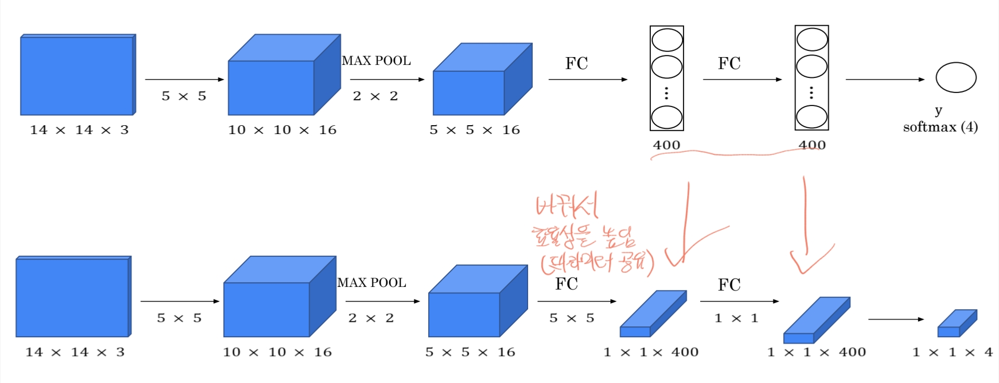

# CNN application

## Object Detection
이미지나 비디오에서 다양한 객체의 위치를 식별하고, 객체가 어떤 종류인지 분류하는 컴퓨터 비전 작업입니다.
**이미지 분류(classification)** 와 **객체 위치 추정(localization)** 을 동시에 수행하는 기술이라 할 수 있습니다.

### 주요 개념
1. Anchor Boxes
   - 객체 탐지에서 사전 정의된 크기와 비율을 가진 바운딩 박스를 의미, 이미지 내 객체 위치를 예측하는 기준이 됨.
   - 여러 Anchor Box를 통해 다양한 크기와 비율의 객체를 탐지할 수 있음.(중첩 이미지 문제 해결)
2. Fully connected layer into convolution layer
   - 연산 효율성을 높이고 모델의 일반화 성능을 개선하기 위한 방법 중 하나입니다. 이는 특히 이미지 분류, 객체 탐지와 같이 고차원 데이터를 처리할 때 유용하게 사용됩니다.
   - fully connected layer는 데이터의 공간적 정보나 위치 관계를 무시한 채 모든 노드를 연결하여 위치 정보가 손실될 수 있지만, convolution은 지역적 정보를 보존한다.
   - 
3. YOLO algorithm(real time detection에 효과적)
   - 기존의 객체 탐지보다 속도와 효율성 문제를 개선하기 위해 등장했다. 기존에는 Region proposal 방식을 이용하여 객체가 있을 가능성이 있는 영역을 제안하고, CNN을 사용해 탐지하는 방식.
   - 이미지 전체를 한 번에 보고 객체 탐지와 분류를 동시에 수행하는 방식으로, 이름 그대로 "You Only Look Once", 즉 이미지 전체를 한 번만 보는 구조로 설계되었습니다. YOLO는 이미지를 **그리드 셀(grid cell)**로 나누고, 각 셀이 특정 객체를 포함할 가능성을 동시에 예측하는 방식을 사용합니다. 이로 인해 YOLO는 빠른 속도로 객체 탐지를 수행할 수 있으며, 실시간 객체 탐지에 적합한 알고리즘이 되었습니다.
   - 구조
     1. 그리드 분할 및 객체 위치 예측
     2. Bounding box 예측
4. IoU(Intersection over Union)
   - 예측된 Bounding box와 실제 object bounding box가 얼마나 겹치는지를 측정하는 지표로, 탐지 성능 평가에 사용된다.(1에 가까울수록 일치)
   - 
   - box가 여러개 있을 때는 값이 높은 값을 선택(Non-max suppression)

### RCNN(Region-Based Convolutional Neural Network)
이미지에서 객체가 있을 가능성이 높은 영역(Region Proposal)을 먼저 찾고, 이 영역을 CNN을 통해 분류하는 객체 탐지(Object Detection) 모델입니다.
객체 탐지의 정확도를 크게 높였지만, 연산 비용이 매우 높았습니다. 이를 개선하기위해 ConvNet을 추가하여 특징 맵을 생성하고 후보군을 뽑아 성능을 높였다.

### Faster RCNN
Region Proposal 생성도 ConvNet을 통해 수행하도록 설계된 모델입니다.
Faster R-CNN은 ConvNet을 이용해 **Region Proposal을 생성하는 네트워크인 RPN (Region Proposal Network)** 을 추가했습니다.
이로써, ConvNet이 이미지의 특징을 추출하면서 동시에 Region Proposal도 생성하여, 속도와 정확도를 더욱 높였습니다.

### 1stage vs 2 stage
1-stage(yolo, ssd, retinanet 등..) vs 2-stage(rcnn, faster rcnn, mask rcnn)

### beyond detection
1. 이미지, 비디오를 감지 후 캡션 달기
2. 이미지 감지 후 각 박스별 상관관계 추론(Scene graphs)
3. 3D object Detection, 3D Shape Prediction

## Segmentation
이미지에서 각 픽셀의 정보를 활용해 객체의 경계를 세밀하게 구분하고, 각 픽셀을 특정 객체나 배경에 할당하는 작업을 의미합니다. 이미지 분류가 전체 이미지에 하나의 레이블을 할당하는 것이라면, 세그멘테이션은 각 픽셀 단위로 레이블을 할당하는 더 세밀한 작업입니다.

### Semantic
동일한 클래스의 객체를 하나로 간주하고, 해당 클래스의 모든 픽셀에 동일한 레이블을 할당하는 방식입니다. 예를 들어, 도로 이미지에서 '차', '사람', '나무'와 같은 객체의 경계를 구분해 각각의 픽셀을 해당하는 클래스 레이블로 지정합니다.
pixel 단위로 분류를 하고 instance 단위로 분류는 안된다.(예를 들어 아래와 같이 소가 2마리인지 식별)

- Fully convolutional network
  - pooling layer 같은게 없으며 오직 conv layer만 있다.(입력 사이즈와 똑같이 나와야한다.)
  - 
  - object가 너무 작거나 크면 정확도가 낮아진다.
- Deconvolution network(DconvNet)
  - single layer에서 확장 영역 삽입하여 정확도를 높인다.
  - 하지만 파라미터가 늘어나는 단점이 있다.
  - 
- Dilated Convolution
  - 필터의 각 요소 사이에 간격을 넣어 수용 필드를 더 넓힐 수 있다.
  - 간격 사이즈를 조절해 다양한 크기의 패턴도 학습 가능하다.
  - 

### Instance
동일한 클래스라도 각 객체를 개별적으로 구분하여 각 객체에 고유한 레이블을 할당하는 방식입니다.
예를 들어, 이미지에 여러 대의 차가 있을 경우, 각 차를 개별 객체로 구분하고 각각의 경계를 구분해 레이블을 지정합니다.

### Panoptic
Semantic Segmentation과 Instance Segmentation을 결합한 방식입니다.
즉, 배경과 객체를 모두 포함하여 각 픽셀에 클래스를 할당하면서도, 인스턴스 객체를 개별적으로 구분합니다.

## Super-Resolution
저해상도(Low-Resolution) 이미지를 고해상도(High-Resolution) 이미지로 변환하는 기술입니다.
이 기술은 주어진 저해상도 이미지에서 세부 정보와 디테일을 보완하고, 선명도를 높이는 작업을 수행합니다.

- Zero Shot SR
  - 사전 학습 데이터 없이 주어진 이미지의 해상도를 낮춰서 원래 이미지를 label로 두고 모델을 학습시키는 방법이다.

## Self-supervised Learning
레이블이 없는 데이터에서 학습할 수 있도록 만든 지도학습 기법입니다.
**CNN(Convolutional Neural Network)** 에서 Self-Supervised Learning을 사용하면, 데이터 자체에서 학습을 위한 레이블을 생성해 대규모의 레이블이 없는 데이터를 활용할 수 있습니다.

학습에 라벨링 비용이 안들며, 때론 성능이 더 좋을 때도 있고, 다양한 소스를 활용 가능하다.

- prtext task는 시각적인 상식에 포커스를 둔다. 그리고 성능보다는 얼마나 유용한가에 대해 중점을 둔다.
- supervision task
  - 
- 직쏘 퍼즐 풀기
- 컬러 채우기
- multi-task self supervised(직쏘 + 컬러 + 채워넣기)
- 회전 이미지 맞추기