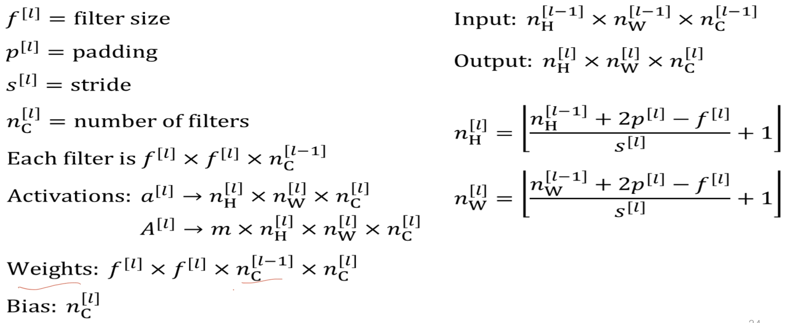
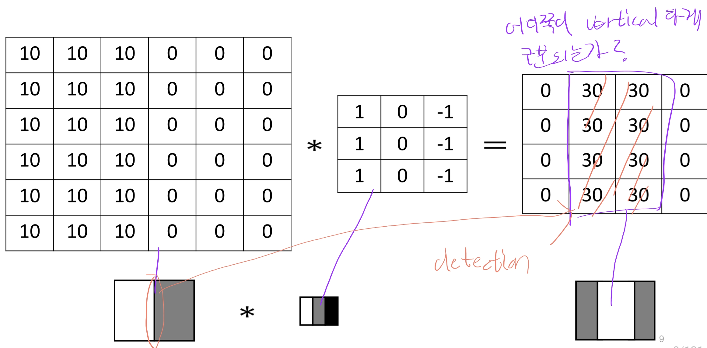
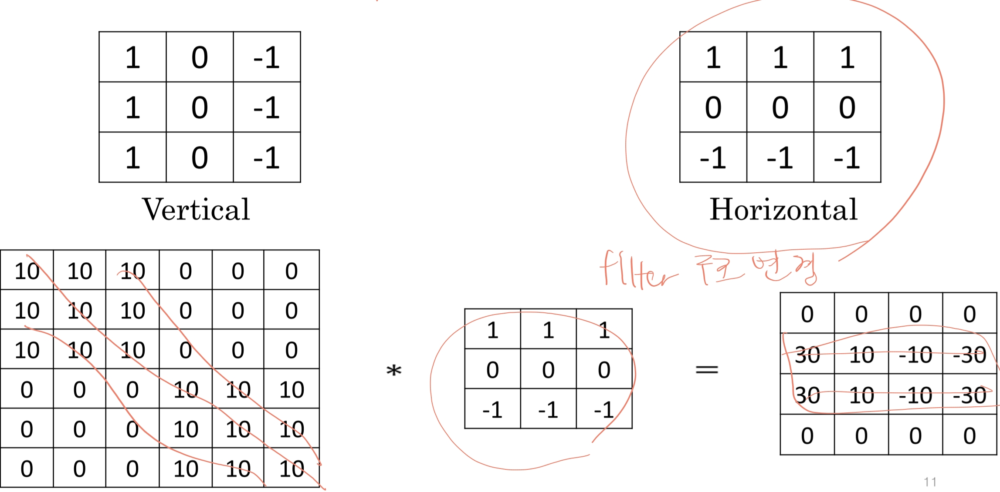
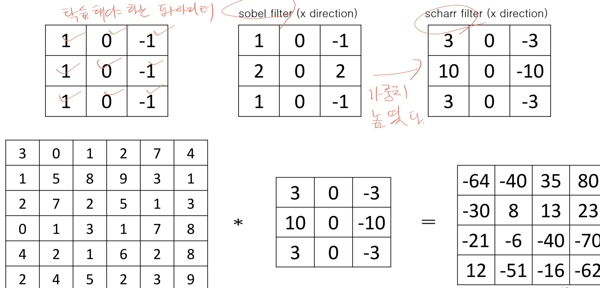
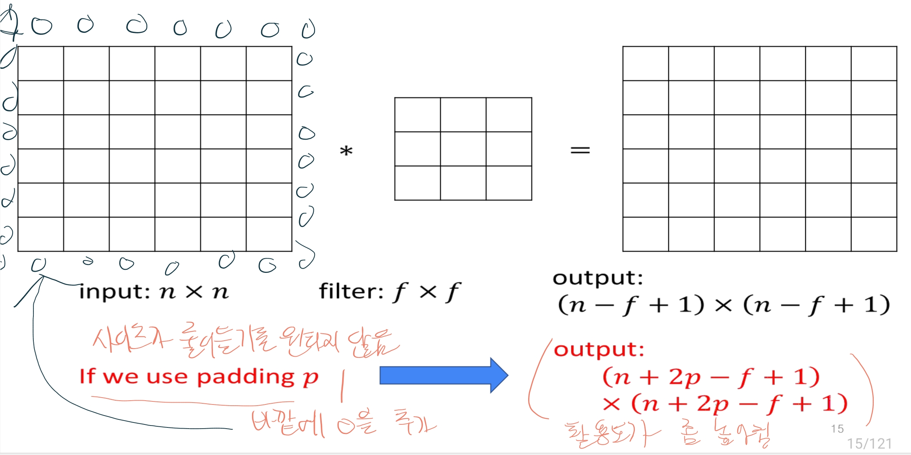
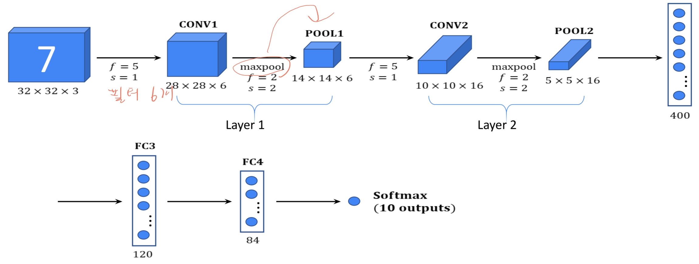
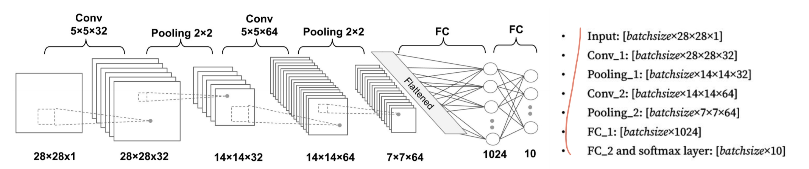

# CNN
이미지, 영상, 텍스트 등 고차원 데이터를 처리하기 위해 설계된 신경망 구조입니다. 
CNN은 데이터를 지역적 패턴과 공간적 관계를 학습하는 데 특화되어 있으며, 특히 이미지 분류, 객체 탐지와 같은 시각적 데이터 분석에 뛰어난 성능을 발휘합니다.

기존의 신경망은 이미지와 같은 고차원 데이터를 처리할 때 많은 파라미터와 계산 비용이 필요해 학습과 추론 과정이 매우 비효율적이었습니다.
또한, 이미지의 지역적 패턴(예: 에지, 모서리, 질감 등)을 효과적으로 학습하기 어려웠습니다.
이를 개선하기 위해 등장한 것이 CNN입니다.

- 장점
  - 효율적인 파라미터 사용(파라미터 공유)
  - 공간적 관계 학습
  - 높은 정확도
  - 위치 불변성(이미지 위치가 조금 바뀌어도 특성 학습 잘 됨)
- 단점
  - 많은 연산 비용(고해상도 or 빅데이터)
  - 고정된 필터 크기(다양한 크기와 비율의 특징 모두 학습 한계)
- 파라미터
  - 

## Edge Detection
이미지에서 경계나 윤곽을 식별하는 작업으로, 이미지의 에지를 검출하면 물체의 형태와 구조를 쉽게 파악할 수 있어 이미지 분류, 객체 탐지 등의 기본 작업에 필수적인 정보로 사용된다.

### Vertical edge detection
어느쪽이 vertical 하게 구분되는지 확인 가능하다.
아래와 같이 가운데 sobel 필터를 적용해서 경계지점을 확인할 수 있다.

sobel 필터를 적용한 수평 예시는 아래와 같다.

가중치를 높인 필터를 scharr filter라고 한다.

### padding
일반적으로 필터 적용 시 output size가 줄어드는데 줄어드는게 싫다면 **padding** 을 추가해준다.
예시와 수식은 아래와 같다.

padding = (filter size) - 1 / 2

### strided convolution
합성곱 연산에서 필터(커널)가 겹치지 않고 일정 간격을 두고 이동하면서 데이터를 처리하는 방식입니다.
파라미터 수 만큼 여러 칸을 한 번에 건너뛰며 이동하므로 계산 위치가 줄어듭니다.

특징
- 출력 크기 축소(x: 5x5, filter: 3x3, result: 3x3, strided: 2x2)
- 연산량 감소
- 모델 구조 단순화

예시(RGB)

> 학습 가능한 파라미터 수는 몇개일까?
> 필터가 3x3x3 구조인게 10개가 있다면? 
> (구조 수 + bias) x filter 수 => (27 + 1) x 10 = 280 
 
## Layer Type
### Convolution(CONV)

### Pooling(POOL)
특징 맵(feature map)의 크기를 줄이고, 주요 특징만 남겨 계산량을 줄이며 모델의 복잡성을 낮추는 역할을 하는 연산입니다.

종류
- Max Pooling
  - 주어진 pooling window 내에서 가장 큰 값을 선택한다. 이미지의 가장 두드러진 특징을 잘 포착하는데 유리하다.
  - 
- Average Pooling
  - pooling window 내의 모든 값을 평균하여 하나의 값을 선택한다. 특성을 놓치는 건 없지만 노이즈 영향은 남아있다.

### Fully Connected(FC)
모든 노드가 완전히 연결된 신경망 층을 의미합니다. FC Layer는 주로 분류(classification) 작업을 수행하는 최종 단계에서 사용되며, CNN이 학습한 모든 특징을 바탕으로 최종 예측을 수행합니다.

## Multilayer CNN
여러개의 layer로 구성되며 일반적으로 Conv + Pooling + Fully connected로 구성되는듯하다.

## CNN 모델 비교
|-|-|-|-|-|
|**특성**|**AlexNet**|**GoogLeNet**|**VGGNet**|**ResNet**|
|**개념**|2012년 등장한 CNN의 성능을 입증한 모델. 깊고 큰 네트워크를 적용함.|네트워크의 깊이를 늘리는 대신 너비를 넓혀 다양한 크기의 필터로 특징을 학습하는 Inception 모듈을 사용합니다.|단순하고 깊은 구조를 통해 복잡한 특징을 학습합니다.|residual learning을 도입하여 깊은 신경망에서도 학습효율을 유지할 수 있도록 한 모델|
|**특징**|- 8개 레이어  - ReLU 활성화 함수 사용 - Max Pooling 사용|- 22개 레이어 - auxiliary losses -다양한 크기의 필터를 병렬로 사용 - global average pooling 사용|- 19개 레이어 - pre training - 3x3크기의 작을 필터를 다층으로 쌓은 구성|- 152 깊은 레이어 - 초깊은 신경망 -기울기소실 해결, 정확도 높음 |
