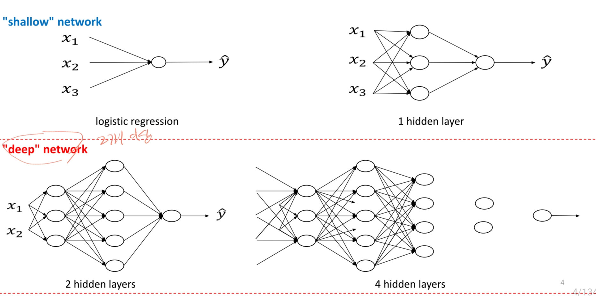
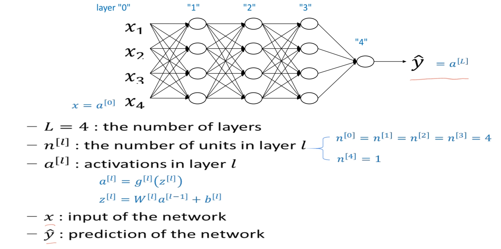
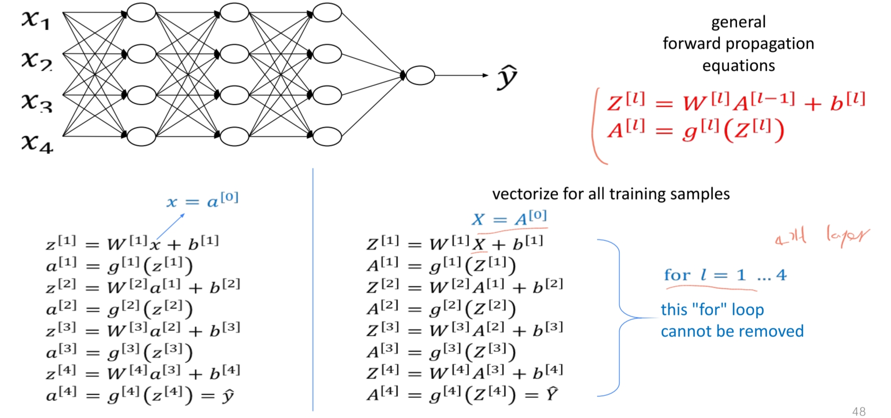
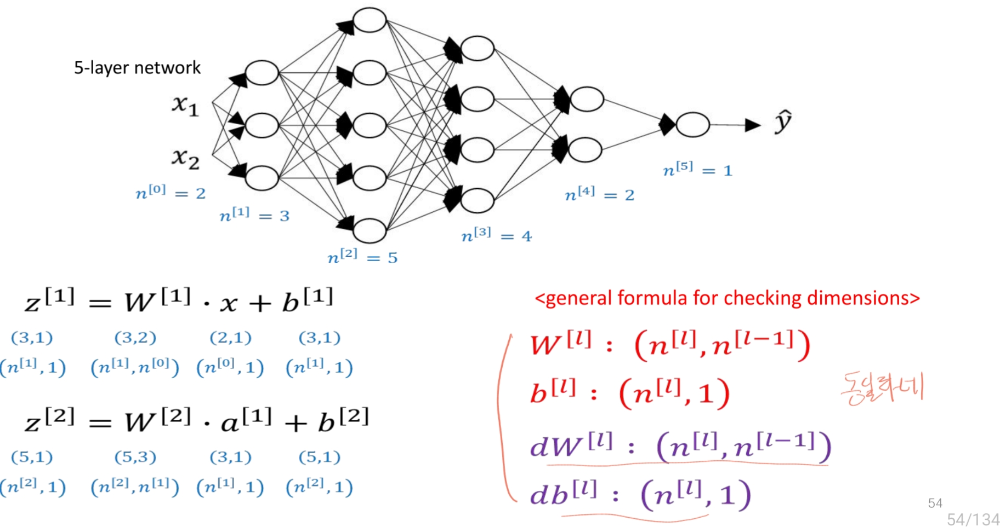
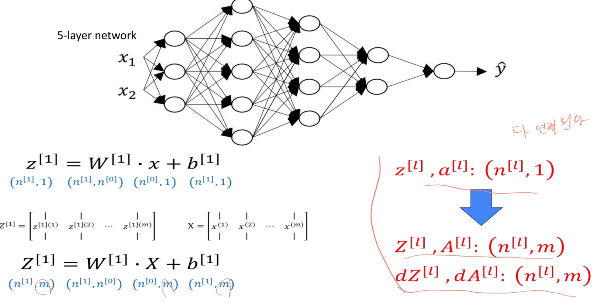
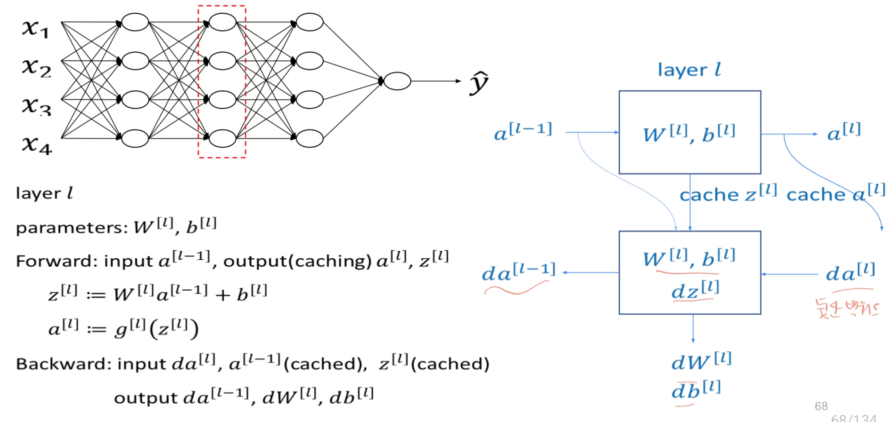
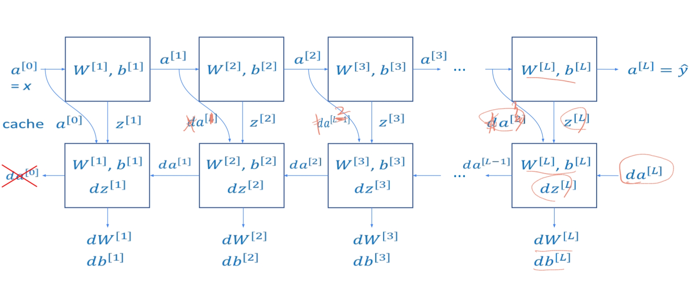
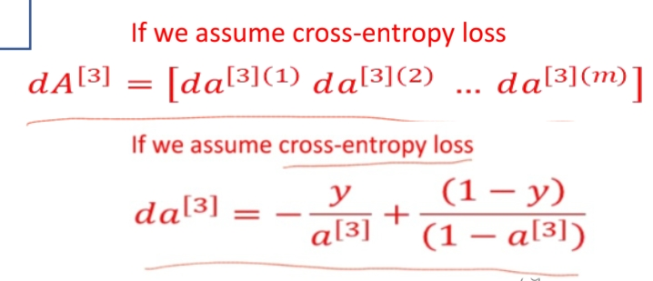
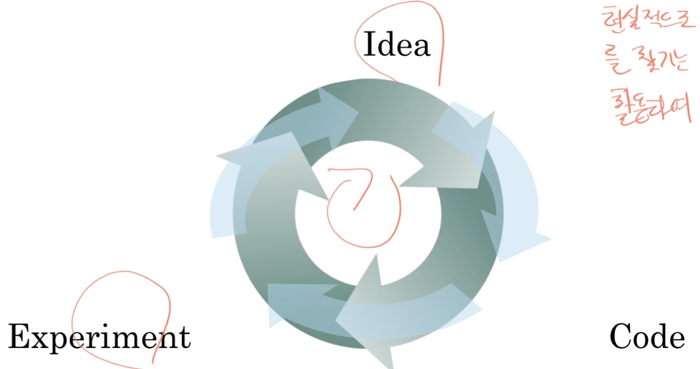

# Deep Neural Network
Shallow neural network와 차이점은 여러 layer로 구성된 인공 신경망 모델이다. 각 레이어가 서로 연결된 다층 구조를 통해 데이터를 처리하고 패턴을 학습한다.
일반적으로 입력층, 여러 개의 은닉층(hidden layer), 출력층으로 이루어져 있으며, 은닉층의 수가 많을수록 깊다(deep)라고 표현한다. 이러한 다충구조 덕분에
복잡한 비선형 패턴을 학습할 수 있으며, 이미지 인식, 음성 인식, 자연어 처리 등에서 뛰어난 성능을 보인다.

## 구성요소

### Forward propagation & Back propagation
- 아래는 4개 레이어 기준 forward propagation 과정이다.

- dimension formula는 아래와 같다.

- X값이 벡터화된 경우 아래와 같이 열의 수 m 만큼 바뀐다.

- propagation 예시

- cross entropy loss 계산시

### hyperparameter
하이퍼파라미터는 학습 과정에 영향을 미치는 설정 값으로, 모델이 학습하면서 자동으로 조정할 수 없는 파라미터입니다. 예를 들어, 학습률(learning rate), 배치 크기(batch size), 네트워크의 층 수, 각 층의 노드 수 등이 대표적인 하이퍼파라미터입니다.
최적의 하이퍼파라미터를 찾는 것은 매우 어려운 일로 레퍼런스, 경험 등을 활용하여 반복 테스트해서 찾아가는 과정이 필요합니다.

### Pytorch
가장 많이 사용되는 deep learning library 중 하나이다.
- Machine learning, deep learning 모델 학습을 효과적으로 수행할 수 있음.
- 대규모 데이터를 이용한 대용량 모델을 학습시키는데 계산량이 많이 요구됨.
- GPU를 효과적으로 활용하려면, CUDA 혹은 OpenCL으로 coding 해야하는데, 이는 구현 및 개발이 어려움.(Pytorch 활용 시 쉽게 가능)
- tensor 기반으로 연산하며, scalar, vector, matrix 모두 포함