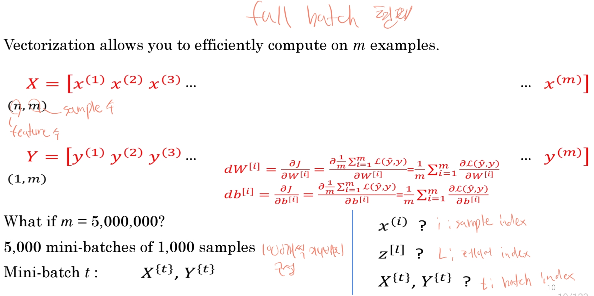
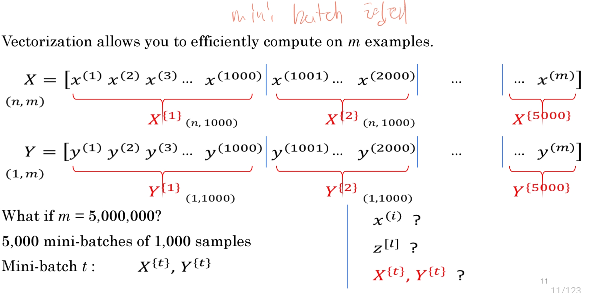
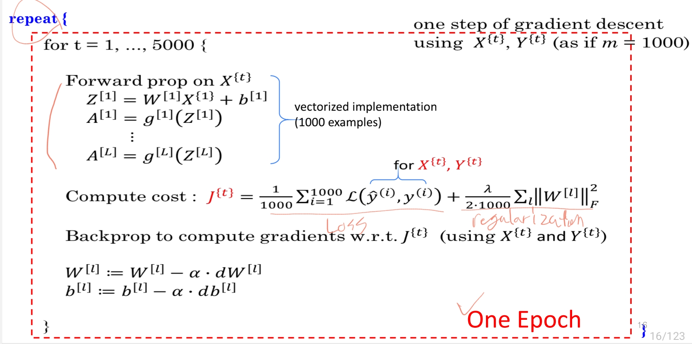
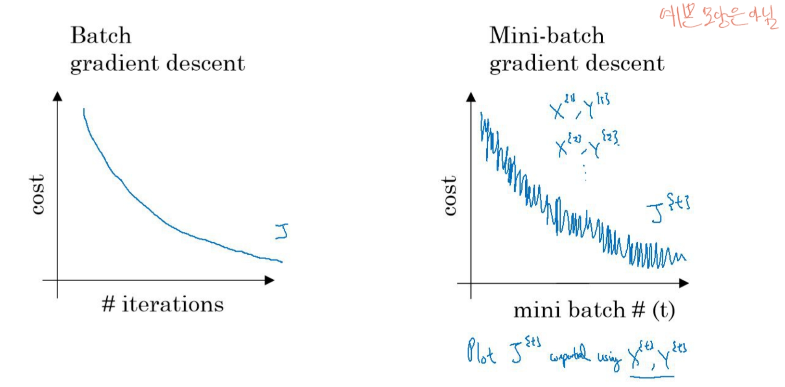
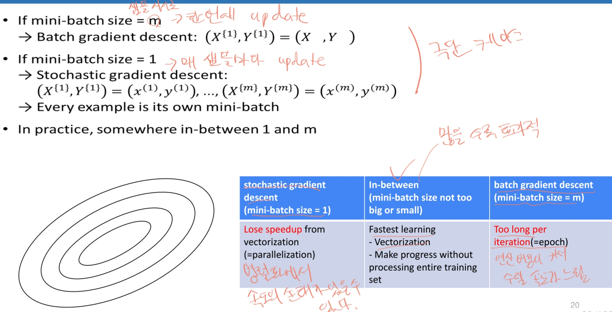
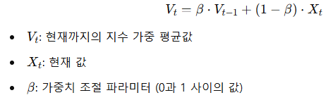
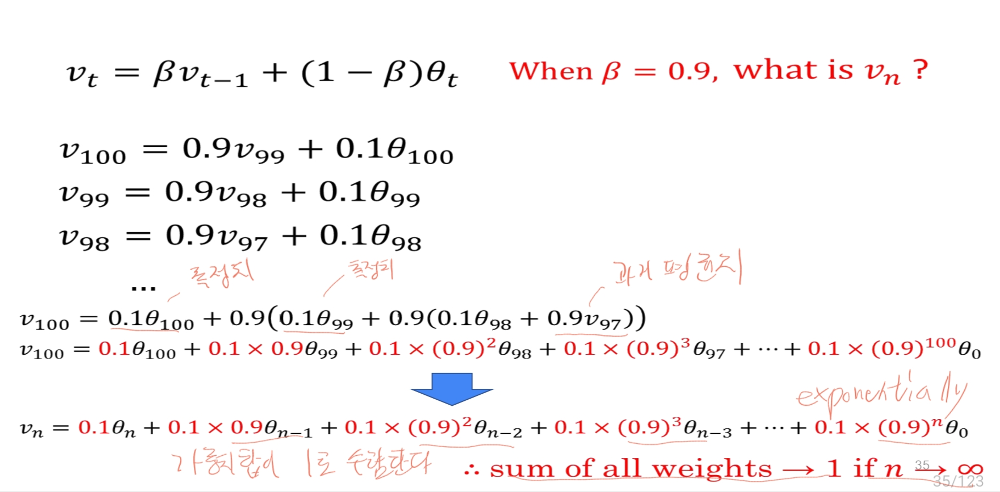
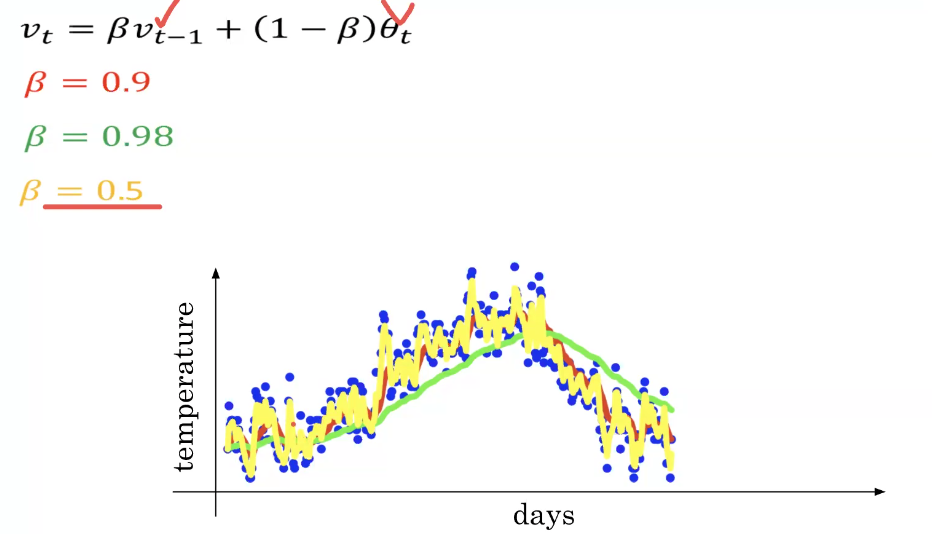

# Hyperparameter tuning
델의 성능을 최적화하기 위해 하이퍼파라미터 값을 조정하는 과정입니다.
머신 러닝과 딥러닝 모델에서 하이퍼파라미터는 학습 과정에 영향을 주지만 데이터로부터 직접 학습되지 않는 파라미터로, 사용자가 미리 설정해야 하는 값입니다.

## batch size(full batch vs mini batch)
배치 크기란 경사 하강법에서 사용되는 데이터 샘플 수를 의미합니다.

### full batch
전체 데이터셋을 사용해 경사를 계산하고 매개변수를 한 번에 업데이트합니다.

### mini batch
데이터셋의 일부 샘플을 사용하여 경사를 계산하고 매개변수를 업데이트 합니다.

미니배치와 풀배치의 시각화를 해보면 아래와 같다.

- 사이즈 고려사항

1. 샘플 사이즈가 2000 보다 작다면 full batch
2. 초과한다면 mini-batch 사이즈 지정(2의 지수승 형태로) - 막 올린다고 해도 memory 제한이 있음.

## Exponentially Weighted Average(EWA)
지수 가중 이동 평균은 최신 데이터에 더 많은 가중치를 부여하고 이전 데이터의 영향은 점차 줄여가며 평균을 계산하는 방법입니다. 이를 통해 데이터의 최근 변화를 반영하는 평균을 얻을 수 있습니다. 주로 시계열 데이터의 평활화나 모델 학습 과정에서의 모멘텀 적용 등에 사용됩니다.

### 수식

### 날씨 변화 예시

## Bias correction