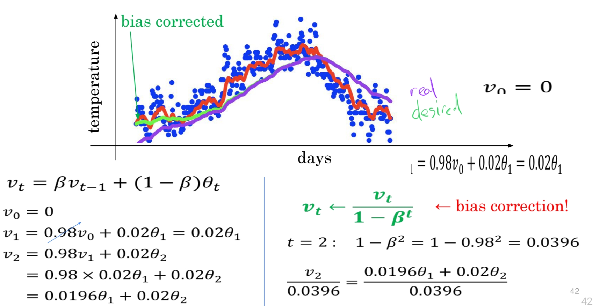
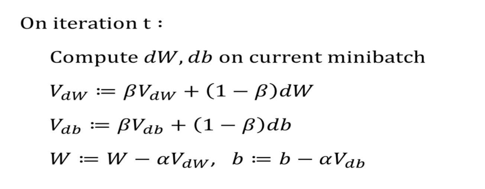
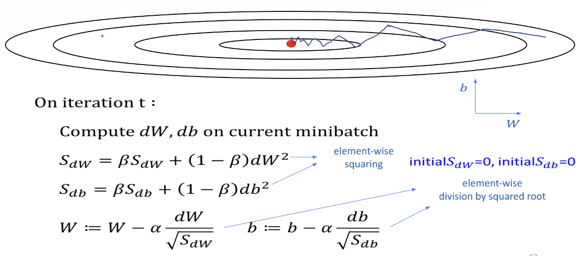

# Hyperparameter tuning
델의 성능을 최적화하기 위해 하이퍼파라미터 값을 조정하는 과정입니다.
머신 러닝과 딥러닝 모델에서 하이퍼파라미터는 학습 과정에 영향을 주지만 데이터로부터 직접 학습되지 않는 파라미터로, 사용자가 미리 설정해야 하는 값입니다.

## batch size(full batch vs mini batch)
배치 크기란 경사 하강법에서 사용되는 데이터 샘플 수를 의미합니다.

### full batch
전체 데이터셋을 사용해 경사를 계산하고 매개변수를 한 번에 업데이트합니다.

### mini batch
데이터셋의 일부 샘플을 사용하여 경사를 계산하고 매개변수를 업데이트 합니다.

미니배치와 풀배치의 시각화를 해보면 아래와 같다.

- 사이즈 고려사항

1. 샘플 사이즈가 2000 보다 작다면 full batch
2. 초과한다면 mini-batch 사이즈 지정(2의 지수승 형태로) - 막 올린다고 해도 memory 제한이 있음.

## Exponentially Weighted Average(EWA)
지수 가중 이동 평균은 최신 데이터에 더 많은 가중치를 부여하고 이전 데이터의 영향은 점차 줄여가며 평균을 계산하는 방법입니다.
이를 통해 데이터의 최근 변화를 반영하는 평균을 얻을 수 있습니다.
주로 시계열 데이터의 평활화나 모델 학습 과정에서의 모멘텀 적용 등에 사용됩니다.

### 수식

### 날씨 변화 예시

## Bias correction
**바이어스 보정(Bias Correction)** 은 추정 과정에서 발생하는 편향(bias)을 보정하여 보다 정확한 값을 얻기 위한 방법입니다.
추정치나 평균을 계산할 때, 편향이 발생할 수 있으며, 이는 주로 작은 샘플 크기나 특정 계산 방식에서 나타납니다.
바이어스 보정은 이러한 편향을 보정해 추정치를 실제 값에 가깝게 만듭니다.

지수 가중 이동 평균(Exponentially Weighted Average, EWA)에서는 초기 값의 영향으로 인해 평균이 참 값보다 낮게 편향될 수 있습니다.
이를 보정하기 위해 보정 계수를 곱해 주어 편향을 줄입니다.

## Gradient descent with **momentum**
mini-batch, full-batch 상관없이 weight, bias 업데이트 시 기존 수식이 아닌 Exponentially Weighted Average를 사용하는 방법을 momentum을 사용한다고 한다.

## RMSProp(root mean square propagation)
딥러닝에서 널리 사용되는 경사 하강법 최적화 알고리즘으로, 각 파라미터의 학습률을 적응적으로 조정해 학습의 안정성과 수렴 속도를 높여주는 방법입니다. 
RMSProp은 경사의 변화가 큰 축에서는 학습률을 낮추고, 변화가 작은 축에서는 학습률을 높여주는 방식으로 작동하여, 특히 진동을 줄이고 빠르게 수렴하도록 돕습니다.

위 이미지를 보면 x축인 W의 거리는 멀고 y축인 b의 거리는 짧다. 그래서 x축은 학습률을 높여줄 수가 있다.
그래서 S_dw를 보면 작아야지 변화를 크게 하고, S_db의 경우 커야 변화를 작게 한다.

## Adam(Adaptive momentum estimation)
요즘들어 많이 사용되는 최적화 알고리즘이다.경사 하강법(Gradient Descent)의 변형으로, 모멘텀(Momentum)과 RMSProp의 개념을 결합하여 효율적이고 안정적인 학습을 가능하게 한 방법입니다.
Adam은 각 파라미터의 학습률을 자동으로 조정하며, 경사 하강법의 빠르고 안정적인 수렴을 위해 개발되었습니다.

일반적으로 파라미터 값을 아래와 같다.

## Learning Rate Decay
Learning Rate Decay는 학습 과정에서 학습률(learning rate)을 점차 줄여나가는 기법을 말합니다.
학습률은 인공지능 모델이 각 반복(epoch) 또는 step마다 가중치를 얼마나 크게 조정할지를 결정하는 파라미터로, 학습 초기에는 학습률을 크게 설정하여 빠르게 최적의 방향을 찾아가도록 하고, 학습이 진행될수록 학습률을 줄여 안정적인 수렴을 이루기 위해 사용됩니다.

테이블을 보면 에포크가 늘어날 때 마다 learning rate는 점점 줄어드는 것을 볼 수 있다.

## Hyperparameter Tip
1. 아래와 같은 그리드 형태로 적용하지 말라. hyperparameter의 중요도는 알 수가 없다.

2. Coarse to fine : 처음에는 거칠게(coarse) 다루다가 점진적으로 세밀하게(fine) 접근하여 해결하는 방법이다.
   - 예시 : 사람 검출의 coarse 단계에서 큰 영역에 얼굴이 있는지 대략적으로 확인한 후 fine 단계에서 얼굴의 위치나 자세 등 세부 정보를 분석합니다.

3. 레이어와 노드 수 같은 hyperparameter는 균일하게 random sample을 뽑아도 괜찮지만 learning rate 같은 경우 범위가 커야할 경우 드문하게, 범위가 작을 경우 빽빽하게(log 추가 같은..) 하는 차이가 있다.
   - 예시 : 100원에서 100원 더하는 것이랑 100만원에서 100원 더하는 것은 다르다.

## Hyperparameter Search
### Grid Search
특정 범위 내의 hyperparameter들을 조합하여 성능을 검수함으로써, 최적의 hyperparameter를 찾는 알고리즘이다.
0.0001부터 1000까지 10배 간격을 차이로 검색한다.

### Randomized Search
Grid Search가 search space에 최적의 hyperparameter가 있다면, 최적의 hyperparameter를 찾을 수 있지만,
비효율적이고 search space에 없는 경우에 성능하락의 가능성이 있어서 개선된 방법이 Randomized Search이다.
Random하게 search space로 설정한다.

### Successive Halving
Randomized search에서 더 개선된 방법으로서, hyper-parameter의 후보군들 중 연속적으로 unpromissing hyperparameter를 하나가 남을 때 까지 제거하는 방법이다.
1. Random sampling으로 hyperparameter 후보군 생성(grid 생성도 가능)
2. 전체 데이터가 아닌 subset으로만 ML모델 학습
3. 학습 결과를 기반으로 50% 후보군 삭제
4. 2번 단계로 돌아가되 subset의 수를 늘여 1개가 남을때까지 계속 반복

### Nested Cross-validation
K-fold cross-validation과 hyperparameter search를 융합 할 수 있음.

## Batch Normalization
- 딥러닝 알고리즘에서 가장 중요한 알고리즘 중 하나이다.
- hyperparameter search를 좀 더 쉽게 만들어준다.
- neural network가 hyperparameter 선택을 좀 더 강인하게 만들어줄 수 있다.
- DNN도 훨씬 더 쉽게 훈련할 수 있게 해준다.
- input을 0, 1을 의미하도록 정규화하면 학습 속도가 빨라진다.

### network에 추가한 케이스
