# Logistic Regression

## Workflow of Predictive Model
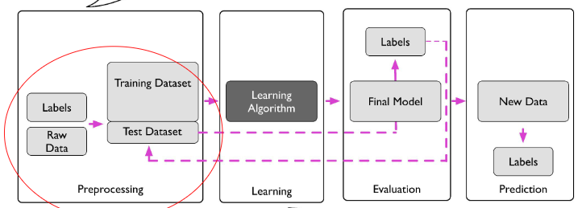
1. Processing: 모델이 더 쉽고 효과적으로 학습하기 위해 전처리를 한다.
   - 사이즈 줄이기
   - 노이즈 제거
   - 중요 정보 추출
   - 데이터셋 분리(train/validation/test)
2. Learning
    - 목적에 맞는 모델을 선택
    - 적절하게 훈련되었는지 확인하기 위한 교차 검증
    - 최적의 하이퍼파라미터 찾기
3. Evaluation
    - 학습이 잘 이루어졌는지 확인할 수 있도록 평가 지표를 적절하게 설계
    - 학습 과정에서 안쓴 데이터를 검증함으로써 모델의 일반화 확인
4. Prediction

## Binary Classification
- 고양이와 고양이 아닌 것을 구분하는 예제로 설명합니다.
- 입력 데이터를 사용해 예측 모델을 만드는 과정이 설명됩니다. 데이터 전처리와 모델 선택, 하이퍼파라미터 튜닝, 교차 검증 등 과정이 포함되어 있습니다.
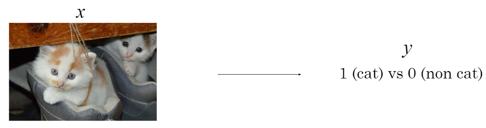

### 수식 표현
- x : input
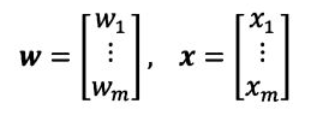
- w : weight
- z : net input, linear combination of x, z (내적)
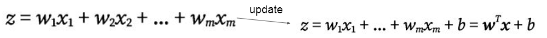
- σ(z) : decision function
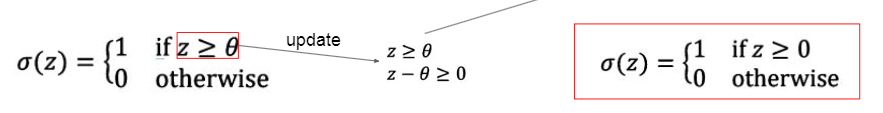

## Perceptron
퍼셉트론(Perceptron)은 인공 신경망의 가장 기본적인 구성 요소이자, 이진 분류 문제를 해결하기 위해 개발된 선형 분류기이다.
여러 개의 입력을 받아서 가중합(weighted sum)을 계산하고, 그 값이 특정 임계값(Threshold)을 초과하면 활성화되어 출력이 1, 그렇지 않으면 출력이 0이 되는 모델이다.
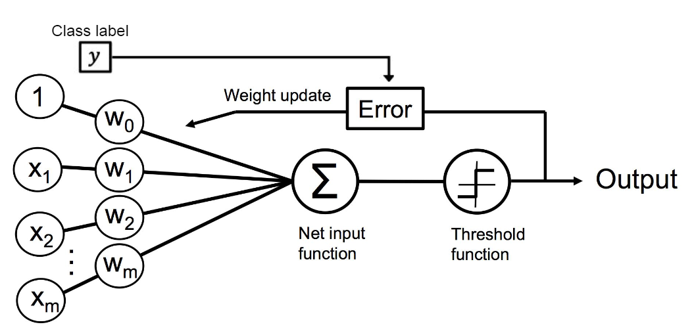

### 수식표현
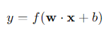
- x : input (x1, x2, ..., x_n)
- w : weight (w1, w2, ..., w_n)
- b : bias(편향 : 임계값을 조정하는 역할)
- f() : 활성화함수
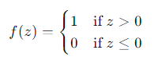

### 학습 과정
1. 초기화 : 가중치 w와 편향 b를 임의의 값(0 or 랜덤)으로 초기화
2. 입력 데이터 처리 : 학습 데이터 넣고 출력 ŷ 계산
3. 오차 계산 : 예측 출력 ŷ과 실제 출력 y 간의 오차를 계산
4. 가중치 업데이트 : 오차가 존재하면, 규칙에 따라 가중치와 편향을 업데이트
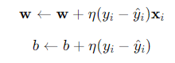
여기서 η는 학습률, 업데이트 속도를 조절
5. 반복 : 오차가 최소화될 때까지 또는 지정된 epoch만큼 반복

### 결론
퍼셉트론은 가장 간단한 형태의 인공 신경망으로, 이진 분류 문제를 해결하기 위한 선형 모델입니다.
퍼셉트론의 학습 과정은 간단하고 직관적이지만, 선형적으로 분리할 수 없는 문제에 대해서는 한계가 있습니다.
이러한 한계는 다층 구조와 비선형 활성화 함수 도입을 통해 극복되었으며, 현대 신경망의 발전에 중요한 토대가 되었습니다.

### Python Example
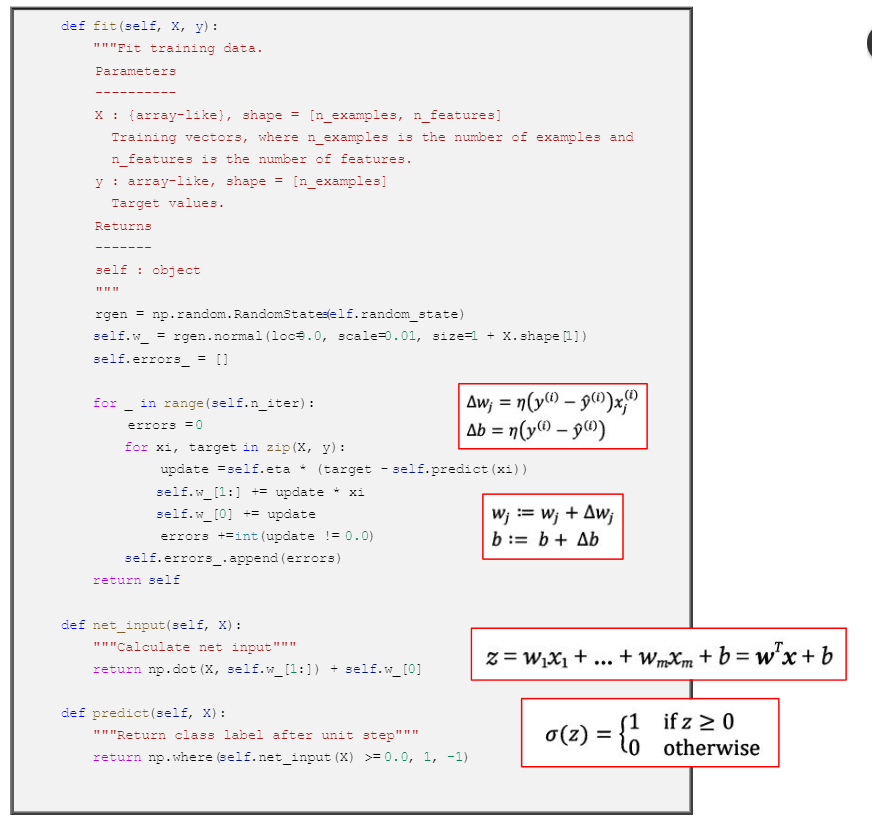
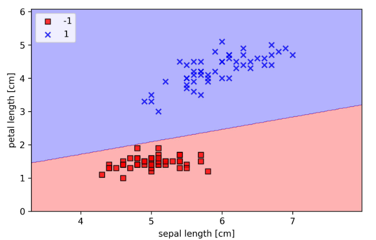

## Adaline
Adaline (Adaptive Linear Neuron)은 퍼셉트론과 비슷하지만 선형 활성화 함수를 사용하여 출력 값과 실제 값을 비교해 손실을 계산합니다.
손실 함수로는 **평균 제곱 오차(MSE)** 를 사용하며, 이 값을 최소화하기 위해 **경사하강법(Gradient Descent)** 을 사용합니다.

- 배치 경사 하강법 (Full Batch Gradient Descent): 전체 데이터를 사용해 손실을 줄이는 방법입니다.
- 확률적 경사 하강법 (SGD): 각 샘플에 대해 즉시 가중치를 업데이트하며, 빠르게 수렴할 수 있는 장점이 있습니다.

## Logistic Regression
로지스틱 회귀는 이진 분류 문제에서 확률을 예측하는 모델입니다. 
선형 회귀와 달리 출력 값을 0과 1 사이의 확률로 변환하기 위해 시그모이드 함수를 사용합니다.

- 시그모이드 함수: 입력 값 z가 매우 큰 양수이면 출력은 1에 가까워지고, 매우 큰 음수이면 출력은 0에 가까워집니다. 이를 통해 결과를 이진 분류 문제에 적합하게 변환합니다.
- 로그 오즈 (Log Odds): 특정 사건이 발생할 확률과 발생하지 않을 확률의 비율을 로그로 변환한 값입니다. 이를 통해 선형 관계를 유지하면서도 확률을 모델링할 수 있습니다.

**비용 함수 (Cost Function)** 는 크로스 엔트로피 손실(cross-entropy loss)을 사용하며, 이는 출력 확률과 실제 레이블 간의 차이를 측정해줍니다.
MSE 대신 크로스 엔트로피를 사용하는 이유는 MSE가 로지스틱 회귀 문제에서는 잘 수렴하지 않기 때문입니다.

## Gradient Descent
로지스틱 회귀의 학습 과정에서 경사하강법을 통해 비용 함수를 최소화합니다.

- 학습률 (Learning Rate): 학습 속도를 결정하며, 너무 크면 발산할 수 있고, 너무 작으면 학습이 매우 느려질 수 있습니다.

- 역전파 (Backpropagation): 모델의 출력에서부터 입력 방향으로 오차를 전파하며 가중치를 업데이트하는 과정입니다. 이를 통해 각 파라미터가 비용 함수에 미치는 영향을 계산합니다.

**계산 그래프 (Computation Graph)** 를 사용해 경사하강법을 적용하는 과정을 설명하며, 각 노드에서의 미분 값을 계산하는 과정이 상세히 다루어져 있습니다.
이러한 그래프는 함수의 출력을 계산하고, 그에 대한 기울기를 효율적으로 계산하기 위한 도구입니다.

