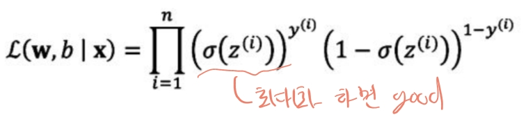

# Logistic Regression

## Workflow of Predictive Model

1. Processing: 모델이 더 쉽고 효과적으로 학습하기 위해 전처리를 한다.
   - 사이즈 줄이기
   - 노이즈 제거
   - 중요 정보 추출
   - 데이터셋 분리(train/validation/test)
2. Learning
    - 목적에 맞는 모델을 선택
    - 적절하게 훈련되었는지 확인하기 위한 교차 검증
    - 최적의 하이퍼파라미터 찾기
3. Evaluation
    - 학습이 잘 이루어졌는지 확인할 수 있도록 평가 지표를 적절하게 설계
    - 학습 과정에서 안쓴 데이터를 검증함으로써 모델의 일반화 확인
4. Prediction

## Binary Classification
- 고양이와 고양이 아닌 것을 구분하는 예제로 설명합니다.
- 입력 데이터를 사용해 예측 모델을 만드는 과정이 설명됩니다. 데이터 전처리와 모델 선택, 하이퍼파라미터 튜닝, 교차 검증 등 과정이 포함되어 있습니다.

### 수식 표현
- x : input
    
- w : weight
- z : net input, linear combination of x, z (내적)
    
- σ(z) : decision function
    

## Perceptron
퍼셉트론(Perceptron)은 인공 신경망의 가장 기본적인 구성 요소이자, 이진 분류 문제를 해결하기 위해 개발된 선형 분류기이다.
여러 개의 입력을 받아서 가중합(weighted sum)을 계산하고, 그 값이 특정 임계값(Threshold)을 초과하면 활성화되어 출력이 1, 그렇지 않으면 출력이 0이 되는 모델이다.

### 수식표현

- x : input (x1, x2, ..., x_n)
- w : weight (w1, w2, ..., w_n)
- b : bias(편향 : 임계값을 조정하는 역할)
- f() : 활성화함수
    

### 학습 과정
1. 초기화 : 가중치 w와 편향 b를 임의의 값(0 or 랜덤)으로 초기화
2. 입력 데이터 처리 : 학습 데이터 넣고 출력 ŷ 계산
3. 오차 계산 : 예측 출력 ŷ과 실제 출력 y 간의 오차를 계산
4. 가중치 업데이트 : 오차가 존재하면, 규칙에 따라 가중치와 편향을 업데이트
    
    여기서 η는 학습률, 업데이트 속도를 조절
5. 반복 : 오차가 최소화될 때까지 또는 지정된 epoch만큼 반복

### 결론
퍼셉트론은 가장 간단한 형태의 인공 신경망으로, 이진 분류 문제를 해결하기 위한 선형 모델입니다.
퍼셉트론의 학습 과정은 간단하고 직관적이지만, 선형적으로 분리할 수 없는 문제에 대해서는 한계가 있습니다.
이러한 한계는 다층 구조와 비선형 활성화 함수 도입을 통해 극복되었으며, 현대 신경망의 발전에 중요한 토대가 되었습니다.

## Adaline(Adaptive Linear Neuron)
Adaline은 퍼셉트론과 비슷하지만 선형 활성화 함수를 사용하여 출력 값과 실제 값을 비교해 손실을 계산합니다.
손실 함수로는 **평균 제곱 오차(MSE)** 를 사용하며, 이 값을 최소화하기 위해 **경사하강법(Gradient Descent)** 을 사용합니다.

perceptron과 차이점은 error를 구하는 위치가 다르고 임계치 분류 전 값으로 epoche가 돌아 온전히 학습 가능하다.(선형 func이 기본모델로 들어감)

### Loss Function
모델은 loss를 줄이기 위해 훈련을 하는데 MSE(Mean Square Error)라는 loss 계산법이 있다.

- y: label
- w: weights, b: bias
- z: net input
- σ(z): decision function

위와 같이 수식값이 주어졌을 때 (라벨값-예측값)^2의 전체 합값을 개수만큼 나눠주면 된다.
σ(z)가 선형함수일 때 아래와 같이 미분 가능하고 볼록한 형태(convex)가 가능해져 최적화가 쉬워진다.

initial weight로부터 loss가 가장 작은 지점인 global cost minimum을 찾아가기 위해 w는 업데이트 된다.
이동방향과 얼만큼 이동시킬지인 학습률은 아래와 같이 수식이 더해진다.

> loss 미분 계산식은 아래와 같다.
> 

### 학습률에 따른 loss 결과

이러한 결과를 나타내는 과정은 아래와 같은 형태이기 때문임.

### Feature Scaling
더 안정적이고 빠르게 학습하기 위한 테크닉으로 사용한다. 각 특성들의 값의 범위가 다르면 부정적인 영향이 있으니 특성 간 범위 차이를 줄인다.
주요 방법으로 Standardization(표준화) 것이 있으며 서로 다른 범위의 변수들을 평균이 0이고 분산이 1인 가우시안정규분포를 가진 값으로 변환하는 작업이다.
 
 
위와 같은 형태로 표준화를 하고 나면 학습이 잘된다.

### GradientDescent 종류
- Stochastic Gradient Descent(SGD, 확률적 경사 하강법)
  - 기존 Batch Gradient Descent는 전체 데이터셋에 대한 손실 함수를 계산한 후 매번 가중치를 업데이트하는데, 데이터셋이 클 경우 계산 비용이 매우 많이 들고 학습 속도가 느려질 수 있다.
    반면, SGD는 무작위로 하나의 데이터 포인트를 선택하여 가중치를 자주 업데이트하므로 빠른 학습이 가능하다.
- Mini-Batch Gradient Descent
  - 데이터셋에서 작은 샘픔을 선택하여 경사를 계산하고 가중치를 업데이트하는 방식이다.
- (Full) Batch gradient descent
  - 전체 데이터셋에 대해 비용 함수를 계산하고 한 번에 가중치를 업데이트 한다. 데이터셋이 클수록 계산량이 많아지며 느려진다.

 

## Logistic Regression
로지스틱 회귀는 이진 분류 문제에서 확률을 예측하는 모델입니다.
파라미터 w, b를 학습을 해서 이상적인 y hat을 구하는게 목표입니다. 
선형 회귀와 달리 출력 값을 0과 1 사이의 확률로 변환하기 위해 시그모이드 함수를 사용합니다.

### formal
입력값 x의 집합이 주어질 때 파라미터 w, b를 같이 계산하여 y hat을 구한다.(y hat = P(y = 1|x))

perceptron, adaline과 그래프를 비교하면 아래와 같다.

- 시그모이드 함수: 입력 값 z가 매우 큰 양수이면 출력은 1에 가까워지고, 매우 큰 음수이면 출력은 0에 가까워집니다. 이를 통해 결과를 이진 분류 문제에 적합하게 변환합니다.
    
- 로그 오즈 (Log Odds): 특정 사건이 발생할 확률과 발생하지 않을 확률의 비율을 로그로 변환한 값입니다. 이를 통해 선형 관계를 유지하면서도 확률을 모델링할 수 있습니다.
로지스틱 회귀에서는 독립 변수의 선형 결합을 Log odds로 간주한다. (logit(p) = log(p/1-p) = w^tx + b)
    
    

**비용 함수 (Cost Function)** 는 크로스 엔트로피 손실(cross-entropy loss)을 사용하며, 이는 출력 확률과 실제 레이블 간의 차이를 측정해줍니다.
MSE 대신 크로스 엔트로피를 사용하는 이유는 MSE가 로지스틱 회귀 문제에서는 잘 수렴하지 않기 때문입니다.

> Bernoulli trial(베르누이 시행)
> - 확률과 통계에서 특정한 조건을 만족하는 단일 시행을 의미한다.
> - 성공과 실패 두 가지 결과만 존재한다.
> - 여러 번 반복되어 이항 분포를 구성할 수도 있다.(동전 10번 던져 앞면이 나오는 횟수)
> - 수식적으로 표현하면 아래와 같다.
>   - 성공 확률 : p, 실패 확률 : (1-p)
>   - 
>   - 각 훈련 샘플이 독립적이라면, 손실은 아래와 같다.
>   - 
>   - Log를 씌운다면
>   - 

크로스 엔트로피는 두 확률 분포 P와 Q간의 차이를 측정하는 지표로, 예측 분포 Q가 실제 분포 P에 얼마나 근접한지를 나타낸다.
즉, 차이를 측정하는 손실 함수로 사용된다.

## Gradient Descent
로지스틱 회귀의 학습 과정에서 경사하강법을 통해 비용 함수를 최소화합니다.

- 학습률 (Learning Rate): 학습 속도를 결정하며, 너무 크면 발산할 수 있고, 너무 작으면 학습이 매우 느려질 수 있습니다.

- 역전파 (Backpropagation): 모델의 출력에서부터 입력 방향으로 오차를 전파하며 가중치를 업데이트하는 과정입니다. 이를 통해 각 파라미터가 비용 함수에 미치는 영향을 계산합니다.

**계산 그래프 (Computation Graph)** 를 사용해 경사하강법을 적용하는 과정을 설명하며, 각 노드에서의 미분 값을 계산하는 과정이 상세히 다루어져 있습니다.
이러한 그래프는 함수의 출력을 계산하고, 그에 대한 기울기를 효율적으로 계산하기 위한 도구입니다.
- Forward propagation: 순서대로 출력을 계산
- Backward propagation: 역으로 loss를 구하고 gradients를 구하는 과정

### Logistic Regression Derivatives에 적용법

위 식에서 learning rate를 적용하여 학습하면 아래와 같아진다.

### 수도코드

loss 구하는 부부낚지가 forward이고 뒤에 가중치 업데이트 부분이 backward이다.

### Linear Regression vs Logistic Regression
