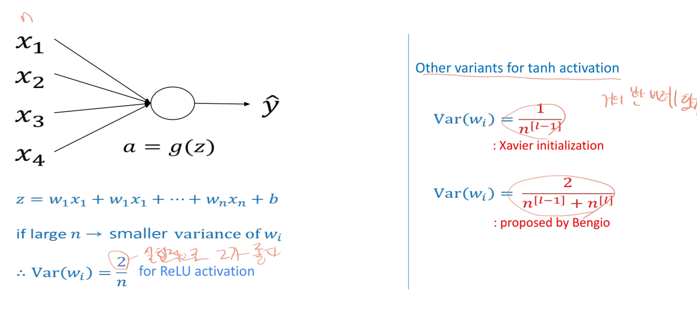

# Setup And Regularization

## Train/Dev/Test sets

1. 과거 연구를 기반으로 training set으로 훈련
2. dev set으로 판단 => 불만족 시 파라미터 수정
3. 최종 파라미터에선 training set + dev set 같이 적용함
4. test set을 테스트하고 일반화 잘 되었는가 평가함.

### Splitting data
데이터가 많고 적음에 따라 분할 비율을 달리 가져가야함. 데이터 많은 경우 평가에 많은 부분을 할당하면 학습데이터가 너무 줄어듬.
- 샘플이 적은 경우(100 ~ 10,000)
  - training/test = 70/30%
  - training/dev/test = 60/20/20%
- Big Data
  - training/dev/test = 99/1/1%
- Training set과 Dev/test set은 유사한게 좋다.

### Bias and Variance
- 편향과 분산의 균형은 전통적인 기계 학습에서 매우 중요한 문제이다. 그러나 딥러닝 시대에서는 그 중요성이 다소 줄어들었다.

- 고양이 분류 예시(사람 에러율 0% 가정)

- 사람 에러율 15% 가정 시 high bias 문제가 없어짐(사람도 분류가 힘든 케이스)

- variance = Dev set error - Train set error
- 그렇다면 어떤 식으로 flow를 가야하는가?

### Cross-Validation
머신러닝의 성능을 평가하고, 과적합 문제를 방지하기 위해 데이터셋을 여러 번 나누어 학습과 평가를 반복하는 방법이다.
* Holdout cross-validation
  * Holdout Cross-Validation은 데이터셋을 학습용 데이터와 검증용 데이터로 한 번 나누어 모델을 평가하는 방법입니다. 이 방법은 데이터를 한 번만 나누기 때문에, k-Fold Cross Validation처럼 여러 번 나눠 학습 및 검증을 반복하지 않습니다.
  * 
* K-fold cross-validation
  * 겹치지 않게 training data를 k set으로 나눔(중복 없이 분할)
  * 아래 그림처럼, validation set을 변경해가면서, k-1개의 training set으로 모델 학습 및 평가
  * k 번의 평가 결과를 평균내어 hyperparameter를 구함
  * 이후, 모든 training set을 이용해 다시 학습하며, unseen test 데이터에 최종 성능 평가
  * 
  * Scikit-learn에서 StratifiedFold 예시
  * 
* Leave-One-Out cross-validation(LOOCV)
  * 데이터의 양이 너무 적으면, k=N인 하나의 샘플로만 평가하는 LOOCV 활용 가능

## Debugging
ML모델을 분석해야 성능을 끌어 올릴 수 있음
- Learning curves와 validation curves를 분석해야 수행 가능
- Overfitting 및 underfitting을 완화시킬 수 있음

### Learning Curves
학습 데이터의 크기에 따라 모델의 성능 변화를 보여주는 그래프이다. 이를 통해 Overfitting(high variance) 혹은 underfitting(high bias)인지 알 수 있다.

Accuracy가 높아서 bias 문제는 없지만 차이가 좀 있어서 variance 문제가 있을 경우 추가 학습으로 완화 가능하다.

### Validation Curves
Training sample에 따른 정확도가 아닌, 모델의 특정 hyperparameter에 따른 정확도를 분석한다.
(파라미터를 정규화)

Parameter C가 크다는 것은 regularization이 적어진다는 것을 의미하고 overfitting이 발생한다.

## Regularization
정규화는 overfitting을 방지하는 것을 돕거나 네트워크 분산을 줄여준다. 손실 함수에 패널치 항을 추가하여, 가중치가 과도하게 커지는 것을 억제한다.

### L2 Regularization (Ridge Regularization)
모델의 가중치(weight) 값이 너무 커지는 것을 방지하기 위해 가중치의 제곱합을 손실 함수에 추가하는 것을 말한다.
가중치 값이 커질수록 패널티가 커지기 때문에, 최적화 과정에서 가중치가 큰 값을 설정되지 않도록 억제한다.

위 수식에서 λ는 정규화의 강도를 조절하는 하이퍼파라미터이고 값이 클수록 가중치 w에 더 큰 패널티가 적용된다.
2m에서 m은 데이터 샘플의 수, 2는 제곱으로 인해 편미분 시 곱해지는 계수이다.

- w1, w2를 weight를 가지는 모델에 MSE(mean squared error) loss 사용 케이스에 정규화
  

### L1 Regularization(Lasso Regularization)
L1 정규화는 L2와 마찬가지로 가중치가 너무 커지는 것을 방지하는 것이 목적이지만, 패널티 항에 가중치의 절댓값을 더하는 방식으로 이루어집니다.
이로 인해 최적화 과정에서 특정 가중치가 0이 될 수 있어, 모델의 불필요한 특징을 제거하는 변수 선택 효과도 얻을 수 있습니다.

- w1, w2를 weight를 가지는 모델에 MSE(mean squared error) loss 사용 케이스에 정규화
  

### 정규화는 어떻게 오버피팅을 방지하는가?

만약 하이퍼파라미터 λ 값을 너무 크게 잡았다면? 모델이 매우 단순해진다.

### activation func이 tanh이고 정규화할 경우

### Dropout Regularization
Dropout Regularization은 인공 신경망에서 과적합(overfitting)을 방지하고 모델의 일반화 성능을 향상시키기 위해 사용되는 정규화 기법입니다. Dropout은 학습 과정 중에 신경망의 일부 뉴런을 랜덤하게 비활성화(drop)하여, 특정 뉴런이나 패턴에 모델이 과하게 의존하지 않도록 만드는 방식으로 작동합니다.

- 장점
  - 과적합 방지 및 일반화 성능 향상
  - 모델이 다양한 특징을 학습하도록 유도하여 특정 패턴에 대한 의존도를 낮춤
  - 학습 과정 중 앙상블 효과로 모델의 안정성을 높임
- 단점
  - 추가된 랜덤성으로 인해 학습 속도가 느려질 수 있음.
  - 학습이 더 복잡해질 수 있으며, 적절한 p 값을 설정하는 것이 중요함.
  - Dropout이 너무 강하게 적용되면 학습이 제대로 이루어지지 않을 수 있음.

### Data Augmentation(데이터 증강)
데이터의 양을 늘리기 위해 원본 데이터를 다양한 방식으로 변형하여 새로운 데이터를 생성하는 기법입니다. 특히 딥러닝에서 데이터가 부족하거나 학습 데이터의 다양성을 높이고자 할 때 효과적입니다.

- 기법은 다양하게 있다...
  - 회전
  - 수평/수직 반전
  - 크기 조정
  - 자르기
  - 동의어 대체
  - 단어 순서 변경

### Early stopping
overfitting을 방지하기 위한 정규화 기법 중 하나이다. 학습을 진행하면서 검증 손실을 모니터링 하고, 검증 손실이 더 이상 개선되지 않으면 학습을 조기에 종료하는 방법이다.

### training set 정규화 예시

test set 평가 시 평균, 분포가 필요한데 data set의 평균, 분포가 비슷하다고 가정하고 수행함.

### 정규화와 기울기 문제의 연관성
정규화 기법은 기울기 소실과 폭발 문제를 완화하는 데 도움을 줄 수 있다. 예를 들어 L1 및 L2 정규화는 가중치의 크기를 제한하여, 학습 중 가중치가 너무 커지지 않도록 합니다.
그래서 기울기 폭발 문제에 특히 효과적입니다.

### Weight Variance Initialization
신경망 학습 시 가중치의 초기값을 설정할 때, 각 층의 출력 값 분포가 안정적으로 유지되도록 하기 위해 가중치의 분산을 조정하는 방법이다.
이 방법은 주로 기울기 소실과 폭발 문제를 완화하기 위해 사용된다.

### Confusion Matrix
Accuracy는 특정 sample에 대한 prediction이 틀렸을 경우, true를 false로 예측했는지,
false를 true로 예측했는지 고려하지 않아서 confusion matrix를 이용하여 보완했다.

- ERR(error)
   
- ACC(accuracy)
  
- TPR(true positive rate)
  
- FPR(false positive rate)
  
- PRE(precision)
  
- REC(recall)
  

  
### F1 Score
F1 Score는 모델의 예측이 얼마나 정확한지를 나타내기 위해, 정밀도와 재현율을 결합한 지표입니다.
Defect을 검출하는 응용에서, REC을 최적화하면 대부분의 예측을 true로 하게될 가능성이 있음(정상 sample도 defect이 있다)
반대로, PRE로 최적화하면, defect이 있다고 예측된 sample의 정확도에 초점을 맞추게 되어, defect이 애매하게 있을 경우 negative로 예측할 가능성 있음

### Matthews Correlation Coefficient(MCC - 매튜 상관 계수)
-1 ~ 1 사이의 값을 가지며, 1에 가까울 수록 답에 가깝다. confusion matrix의 모든 값을 활용하여 계산한다.

### Receiver Operating Characteristic (ROC)
**ROC**는 분류 모델의 성능을 평가하기 위해 사용되는 그래프입니다. 특히, ROC 곡선은 모델이 다양한 **임계값(threshold)** 에서의 분류 성능을 시각화하여, 모델의 **민감도(Sensitivity)** 와 특이도(Specificity) 간의 균형을 평가할 수 있게 합니다.
ROC의 곡선은 참 양성 비율과 거짓 양성 비율의 관계를 나타내는 그래프이며 왼쪽 상단에 근접할 수록 좋은 분류기이다.

### Micro average, Macro average
Micro Average와 Macro Average는 다중 클래스(multi-class) 분류 문제에서 Precision, Recall, F1 Score와 같은 평가 지표를 계산할 때 사용하는 평균 계산 방법입니다.
다중 클래스 문제에서 각 클래스의 성능을 통합하여 하나의 성능 지표로 나타내고자 할 때, 두 방식의 평균이 서로 다른 의미를 가지므로 적절한 방식을 선택하는 것이 중요합니다.
- Micro average : 전체 값들에 대한 평균
- Macro average : 각 class의 평균 정확도의 평균
### Class imbalance
클래스 불균형은 실제세계에서 흔히 발생하는 문제이다.
class imbalance가 있는 데이터 셋으로 학습하게 되면, 양이 많은 class에 편중되어 학습되게 된다.
소수만 있는 class 데이터 샘플에 높은 가중치를 두고 학습하여 완화할 수 있고, 양을 조절하는 방법도 있다.