# Shallow Neural Network
얕은 신경망이라고도 하며, 일반적으로 은닉층이 하나뿐인 구조를 가리킨다. 입력층과 출력층 사이에 은닉층이 위치한다.
- 입력층 : 모델이 학습할 데이터를 입력받는 층
- 은닉층 : 입력을 비선형 변환하여 복잡한 패턴을 학습하는 층
- 출력층 : 학습 결과를 출력하는 층

## 구성
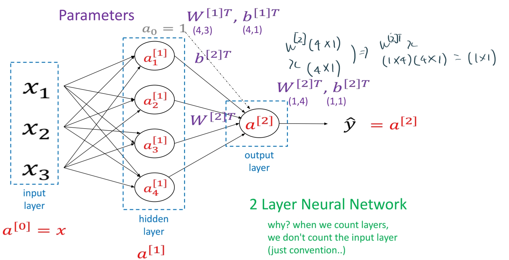

### forward propagation
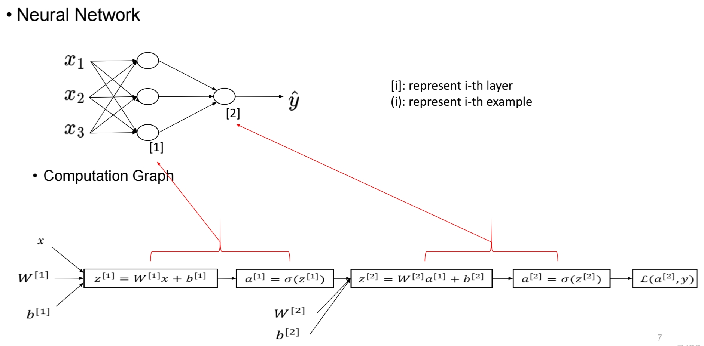
### backward propagation
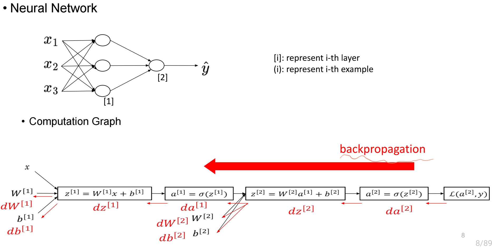

### 기본적인 계산법 흐름
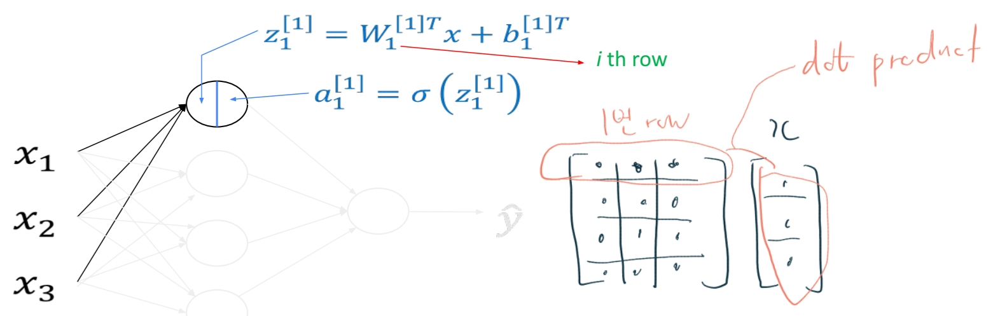
위와 같이 1개 row씩 순차적으로 계산하면 아래와 같은 구성이다.
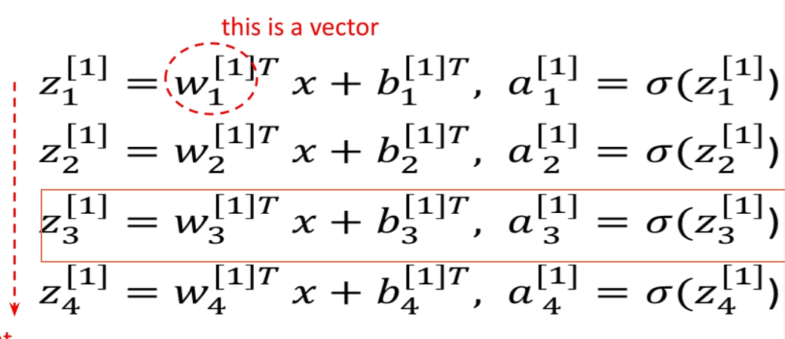
하지만 위와 같이 반복적으로 계산하는 것은 비효율적이라 묶어서 matrix 만들어 계산한다.
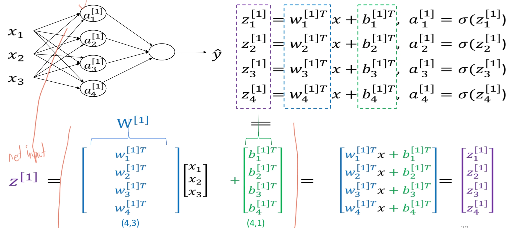
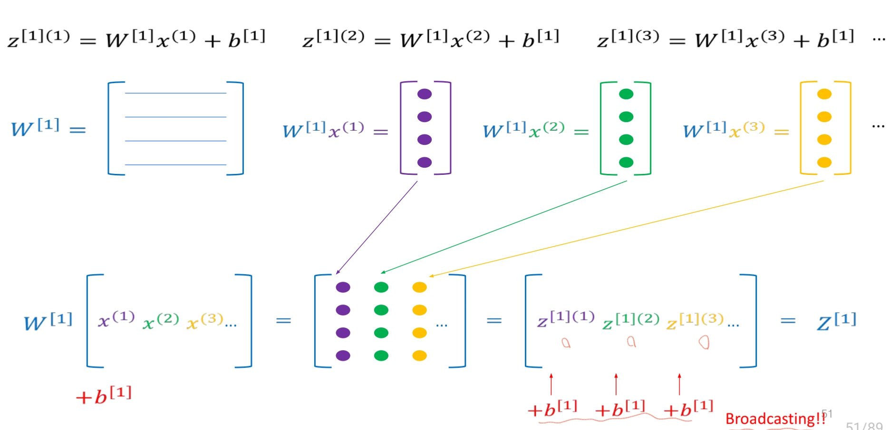

### Activation function
- sigmoid function: 일반적으로 시그모이드 함수는 다른 non-linear activation function을 대체한다.
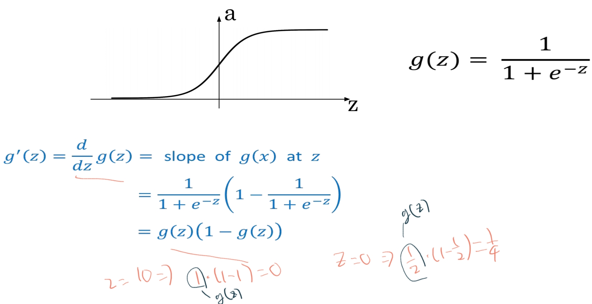
- tanh : -1에서 1 사이의 값을 출력하는 함수이다. 거의 대부분 학습에서 sigmoid보다 낫다. 하지만 끝부분에서 기울기 소실이 발생할 수도 있다.
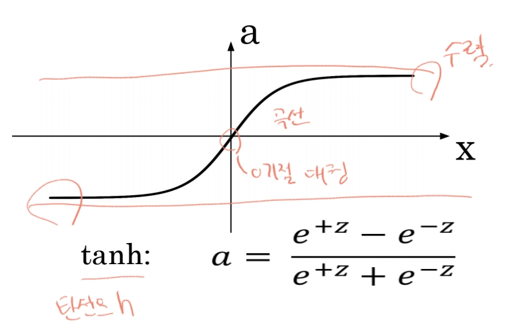
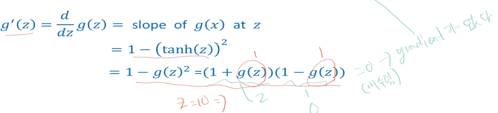
- sigmoid + tanh
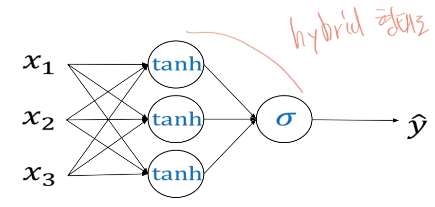
- ReLU(Rectified linear unit): 입력이 양수이면 통과하고, 음수이면 0으로 변환한다.
  - 출력값의 범위가 0에서 양의 무한대까지로 양수 값을 효과적으료 표현가능하다.
  - 기울기 소실 문제를 완화하여 딥러닝 학습 속도를 크게 향상시킬 수 있다.
  - 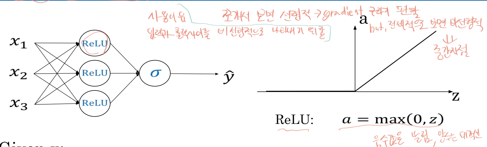
  - 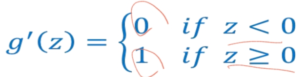
- Leaky ReLU: 기존 ReLU는 negative 영역에서 손실이 있는 것을 개선한 버전
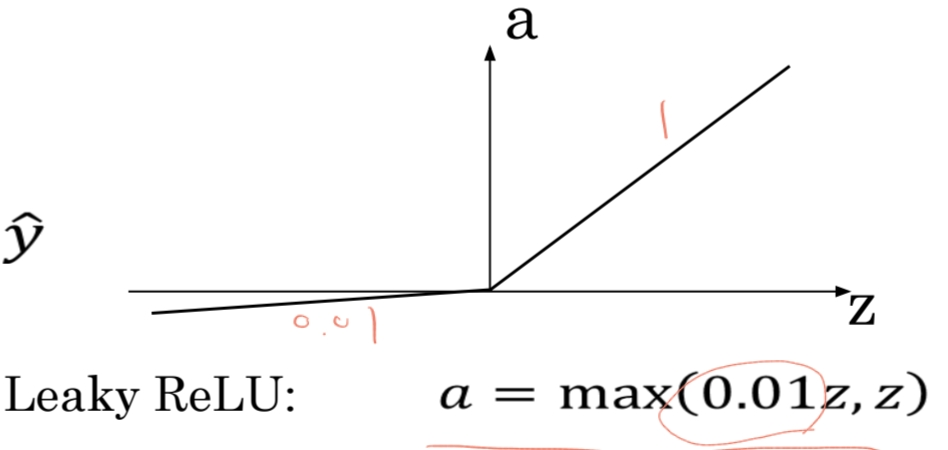
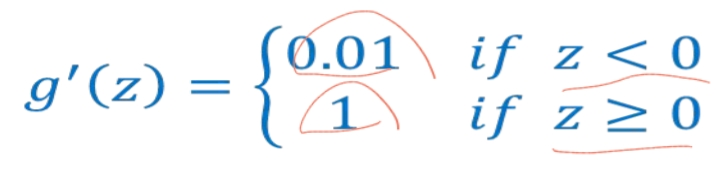

> 그렇다면 non-linear activation function은 왜 필요할까? 
> 복잡한 비선형 관계를 학습할 수 있도록 하기 위함이다. 비선형 함수를 사용하지 않으면, 각 층에서 선형변환만이 이루어지게 된다. 
> 즉, 모든 층을 통과한 최종 출력이 여전히 선형 변환으로만 표현될 수 있다. 그래서 단일 선형 변환과 동일하게 되어 층을 깊게 쌓는 의미도 없어진다.
 
### Gradient 계산 예제
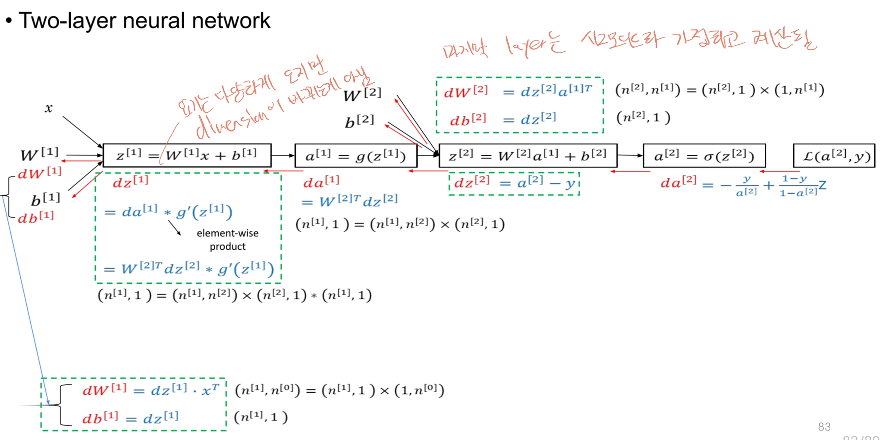
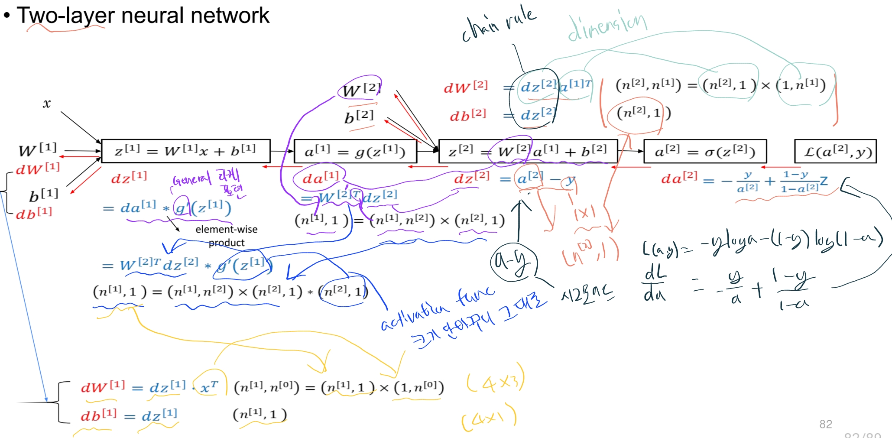
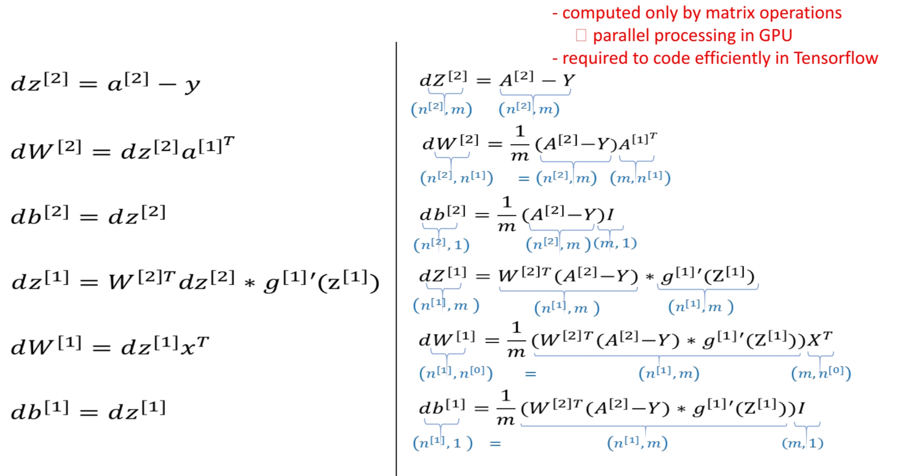