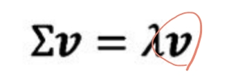

# Unsupervised Learning
비지도 학습은 입력 데이터에 대한 레이블 없이 모델이 데이터의 패턴을 스스로 찾아내는 방식입니다. 데이터의 구조를 이해하거나 데이터 내에서 유사한 항목을 그룹화하는 데 주로 사용됩니다.
예를 들어, 고객의 구매 데이터를 사용해 특정 행동 패턴을 가진 그룹을 찾아내는 것이 가능합니다.

## Supervised Learning
이전 목차까지 배운건 지도학습이다. 지도 학습은 모델이 학습할 때 입력 데이터와 이에 대한 정답(레이블)을 함께 제공하는 방식입니다. 이를 통해 모델은 주어진 입력에 대해 정답을 예측하는 방법을 학습하게 됩니다.
예를 들어, 사진을 입력으로 주고 사진 속 인물이 누구인지에 대한 레이블을 제공하면, 모델은 학습을 통해 새로운 사진에 대해서도 인물을 예측할 수 있게 됩니다.

### Category & Example
- Classification

- Regression

## Unsupervised Learning
- 레이블 불필요: 정답이 없으므로 데이터 준비에 드는 비용이 적습니다.
- 패턴 탐색: 데이터의 분포나 패턴을 찾는 데 효과적이며, 데이터 군집화나 차원 축소 등에 적합합니다.
- example : Clustering, Compression(용량 줄여야 하는데 방법을 모를 때), Feature & Representation(중요한 데이터 뽑기), Dimensionality reduction, Generative model..

### Principle Component Analysis(PCA - 주성분 분석)
고차원의 데이터를 저차원으로 축소하는 차원 축소(dimensionality reduction) 기법입니다. 
여러 변수 간의 상관관계를 분석해 데이터의 중요한 특징을 유지하면서 데이터를 단순화하는 방식으로 작동합니다. 이를 통해 데이터의 주요 패턴을 더 명확하게 파악할 수 있으며, 노이즈 제거 및 시각화 용이성의 장점이 있습니다.

- 특징
  - 중요한 데이터만 남기면서 효율성 올리고 overfitting 완화
  - 2,3차원으로 시각화가 가능해져 패턴 분석이 쉬워짐
  - 전처리 용도로 사용
- 한계
  - 선형성 가정(비선형 관계를 설명하기 어려움)
  - 차원 축소하면서 정보 손실 가능
  - feature scale에 민감하기 때문에 정규화가 필요함
- 절차
  1. d-dimensional 데이터 정규화
     - 평균은 0, 표준 편차는 1로 변환
     - 
  2. convariance matrix(공분산 행렬) 계산
     - 공분산은 두 개 이상의 변수 사이의 상관관계를 나타냄
     - x1과 x2 사이의 공분산이 0보다 크면, x1이 커질 때 x2도 같이 커지는 경향. 0보다 작으면 반대 경향.
     - 공분산이 0이면 두 변수 사이에 상관 관계가 없음
     - 
  3. Egienvector와 eigenvalue를 구하기 위한 Eigenvalue Decomposition
     - v는 eigenvector, λ는 eigenvalue, 13차원 feature = 13개 eigenvalue
     - 
  4. Eigenvalue 정렬
     - 전체 eigenvalue 합 대비 eigenvalue 값의 비율
  5. Top-k Eigenvector와 eigenvalue 선택
     - 아래 이미지처럼 주성분이 어느정도 비율인지 확인
     - 
  6. 선택된 K개의 eigenvector로 부터 projection matrix W구하기
     - decomposition 수행 후 얻은 eigenvalue 값을 이용하여 정보량이 많은 eigenvector 선택, projection matrix 만듬
  7. W를 이용해 d-dimensional 데이터를 k-dimensional 데이터로 변환
     - projection matrix를 이용하여 feature transform 수행
     - 
- 예시(13차원 데이터 > 2차원 projection)
  - 

### Linear Discriminant Analysis(LDA)
데이터의 분류(classification) 를 목적으로 하는 지도 학습 기반의 차원 축소 기법입니다. 데이터의 클래스 간 분산을 극대화하고, 클래스 내 분산을 최소화하도록 차원 축소를 수행하여 분류 성능을 높이는 데 주로 사용됩니다. 주성분 분석(PCA)과는 다르게, 데이터의 클래스 정보를 활용해 변환을 수행합니다.

- 특징
  - 차원 축소: 입력 데이터의 차원을 줄여 처리 속도를 높이고 데이터 구조를 단순화함
  - 분류 성능 개선: 클래스 간 구분을 극대화하는 방향으로 데이터를 변환해 분류 성능 향상
- 한계
  - 선형성 가정(비선형 관계를 설명하기 어려움)
  - 정규분포 가정(클래스 간 데이터가 정규 분포를 따른다는 가정이 필요)
- 절차
  1. d-dimensional 데이터 정규화
  2. 각 class별로 d-dimensional mean vector 계산
  3. Between-class scatter matrix, within-class scatter matrix 계산(S_b, S_w)
     - S_w : 각 class별로 평균과 얼마나 멀리 퍼져있는지를 표현
     - 
     - S_b : class간 상관 관계를 표현
     - 
  4. Eigenvalue, eigenvector 계산
     - 역행렬 구하고 고유값 decomposition
  5. Top-k Eigenvector, eigenvalue 선택
  6. 선택된 K개의 eigenvector로 부터 projection matrix W구하기
  7. W를 이용해 d-dimensional 데이터를 k-dimensional 데이터로 변환

### Manifold Learning
실제 세계에서는 데이터가 nonlinear하게 분포된 경우가 많아 PCA, LDA는 적합하지 않음. Manifold는 비선형 구조를 찾아내어 차원을 축소하는 기법이다.

## Clustring
대표적인 비지도 학습 기법 중 하나이며, 같은 cluster에 속한 데이터 샘플 간의 유사도는 높이고 다른 cluster에 있는 샘플과의 유사도는 낮추는 방법이다.

### K-means
비슷한 sample끼리 grouping하는 간단한 알고리즘

- 특징
  - 각 군집을 대표 prototype으로 표현(클러스터 중심-centroid을 기준으로 데이터 배정)
  - K가 clustering 개수(최적의 k 결정이 중요)
- 절차
  1. Random으로 K개의 sample을 초기 centroids로서 선택
  2. 모든 sample에 대해 K개의 centroids와 거리를 측정하여, 제일 가까운 centroid의 군집으로 할당
     - 대표적인 측정 방법 : Squared Euclidean distance
     - 
     - Sum of squared error(SSE)를 측정해서 응집도 확인
     - 
  3. 같은 cluster로 할당된 sample들의 평균을 구하여 centroid를 갱신
  4. step2, step3의 특정 조건이 만족될 때 까지 반복
- example
  - 음악, 영화 카테고리화
  - 구매자 행동을 기반으로 비슷한 관심사 추천
  - 2차원 feature 기준의 150개 샘플, 3개의 centroid 데이터 예시
    - 
- 한계
  - K를 사전에 정해야함
  - Overlap 허용 안함, 하나의 sample은 하나의 cluster에 속함
  - 계층적 분류 불가
  - outlier에 민감
  - 초기 centroid에 영향 많이 받음
    - 개선을 위해 여러번 학습시켜 보고 가장 좋은 성능 모델을 선택

### K-means plusplus
K-means의 개선된 버전. centroid를 더 효과적으로 초기화하여 효율적으로 만든다.

- 절차
  1. K개의 centroid를 저장할 빈 matrix M 생성
  2. 첫번째 centroid는 random하게 생성 후, M에 저장
  3. M에 소속되지 않은 남아있는 sample에 대해, M에 있는 centroid들과의 distance 중 최소값을 구함
  4. step3에서 구한 값에 기반하여, 기존 centroid들과의 최소거리가 가장 먼 sample을 다음 centroid로 선택 후 M에 추가
  5. step3, 4를 k개의 centroid가 선택될때까지 진행
  6. 앞서 선택된 K개의 centroid를 이용하여 Classic K-means clustering 수행

### Fuzzy C-Means(FCM)
K-means는 하나의 sample에 하나의 cluster를 할당하는 hard clustering인데 여러개의 cluster에 할당이 필요한 경우가 있다.
이때 사용하는 방법이 Soft Clustering이며 FCM이 있다. 0,1 할당이 아닌 0~1 사이 값으로 추론.

- 절차
  1. K개의 centroid를 random하게 설정하고 각 sample에 class membership 부여
  2. 각 cluster의 centroid 계산
  3. 각 sample의 membership을 update
  4. step2, 3을 특정 조건이 만족 될 때 까지 반복

> Elbow Method
> 클러스터링에서 최적의 클러스터 개수를 선택하는 데 사용되는 기법입니다. K-Means와 같은 클러스터링 알고리즘에서 클러스터 개수
> K를 사전에 지정해야 하는데, 이때 엘보우 기법을 통해 데이터에 적합한 클러스터 개수를 찾을 수 있습니다.
> 1. SSE 계산
> 2. SSE와 클러스터 개수 K의 관계 그래프 생성(특정 시점 이후로 감소 폭이 줄어들음)
> 3. 엘보우 지점 찾기(SSE가 급격히 감소하다가 완만해지는 시점-팔굼치처럼 꺾이는 지점을 찾는다. 이 지점이 최적의 K 값)
> 
 

### Hierarchical Tree
데이터 포인트 간의 계층 구조를 이용해 클러스터를 형성하는 비지도 학습 기법입니다.
이는 트리 구조를 통해 데이터의 유사도를 표현하며, 데이터 간의 계층적 관계를 시각적으로 파악할 수 있습니다. 계층적 클러스터링은 특히 데이터의 계층적 군집 구조를 찾는 데 유용합니다.

- 접근방식
  1. 병합형 클러스터링(Agglomerative Clustering - bottom up)
     - 개념 : 각 데이터 포인트를 하나의 클러스터로 시작해, 가장 가까운 클러스터들끼리 병합
     - 
     - 측정 방법
       - Single linkage(최단 거리): 클러스터 사이의 가장 가까운 멤버 사이의 거리가 가장 작은 클러스터를 결합
       - Complete linkage(최장 거리): 클러스터 사이의 가장 먼 멤버 사이의 거리가 가장 작은 클러스터를 결합 
  2. 분할형 클러스터링(Divisive Clustering - top down)
     - 개념 : 전체 데이터셋을 하나의 클러스터로 시작해, 점진적으로 나눠가는 기법
- 장점
  - 구현하기 간단하고, 확장성이 있다.
  - 계층형 클러스터가 가능하다.
- 한계
  - 데이터 포인터가 많을 경우 계산량이 급격히 증가한다.
  - 노이즈와 이상치에 민감하다
  - 병합 후에는 클러스터 재구성이 불가능하다.

### Density based spatial clustering
Sample의 밀집한 영역들을 기반으로 cluster를 형성하는 알고리즘.
Density는 특정 radius 내의 points 수로 정의됨.
1. Density-based spatial clustering of applications with noise(DBSCAN)
   - 할당 절차
     1. 특정 기준 이상 수의 이웃한 point(MinPts)가 특정 radius 안에 들어오면 해당 point를 core point로 간주
     2. MinPts 보다 적은 이웃 points를 가지지만, core point의 raidus에 있는 경우 border point로 간주
     3. Core point border point 둘 다 아닌 경우 noise point
   - example
     - 
   - 장점
     - 비구형 클러스터 탐지
     - 노이즈, 이상치 삭제 가능
     - 클러스터 수 k 미리 설정 필요 없음
   - 단점
     - 파라미터 설정 어려움
     - 밀도가 균일하지 않을 시 인식 안될 수 있음
     - 고차원 데이터에서 성능 저하 가능(차원 제거 필요)

2. Mean shift algorithm
   - 커널 밀도 추정(Kernel Density Estimation, KDE) 방식을 사용해 데이터 포인트가 많이 밀집된 곳으로 이동하면서 클러스터의 중심을 찾습니다.
   - 절차
     1. 윈도우 크기 설정
     2. 포인트 지정
     3. mean 계산, 이동(밀도 높은 지점까지)
   - 활용 예시
     - 이미지 처리: 이미지 영역을 나누거나, 색상 클러스터링 통해 객체 분리
     - 컴퓨터 비전: 객체 추적에서 이동 경로를 추적 가능

## Autoencoder(AE)
인공 신경망을 활용하여 데이터를 압축하고 복원하는 비지도 학습 모델입니다. 주어진 데이터를 입력하여 저차원 표현(인코딩)을 학습한 후, 다시 원본 데이터로 복원하는 과정을 거치면서 특징을 추출하고 노이즈 제거, 차원 축소, 이상치 탐지 등에 활용됩니다.

오토인코더는 주로 입력과 출력이 동일한 형태로 구성되며, 입력 데이터를 압축한 후 압축된 정보를 기반으로 원래 데이터를 재구성하도록 훈련됩니다

- 구조
  - Encoder
    - 입력 데이터를 **압축하여 저차원 표현(latent representation)** 으로 변환하는 부분입니다
    - 고차원 데이터를 저차원 공간에 매핑하여 중요한 특징만을 남기고 불필요한 정보는 제거합니다.
    - 주로 완전 연결 신경망 또는 CNN, RNN 등을 이용해 구현합니다.
  - Decoder
    - 인코더에서 생성된 저차원 표현을 기반으로 원래의 입력 데이터로 복원하는 역할을 합니다.
    - 저차원 표현을 입력 데이터의 차원으로 확장하여, 인코더에서 학습한 정보로 원본과 유사한 출력을 생성합니다.
  - Type
    - UnderComplete AE
      - input layer보다 hidden layer가 작을 경우 undercomplete 구조라고 한다.
      - input을 압축해서 중요한 특징만 추출하고, 불필요한 정보를 제거하는데 유리하다.
    - OverComplete AE
      - input layer보다 hidden layer가 클 경우 overcomplete 구조라고 한다.
      - 복잡한 패턴과 구조를 학습할 수 있다.

### Convolutional AE
이미지나 영상과 같은 고차원 데이터의 특징을 추출하고 재구성하기 위해 **합성곱 신경망(CNN)** 을 사용한 오토인코더입니다.
CAE는 주로 이미지의 중요한 시각적 특징을 학습하고, 이를 기반으로 데이터를 압축하거나 재구성하는 데 사용됩니다. 기본 오토인코더와는 달리,
CAE는 **합성곱 층(Convolutional Layer)** 을 통해 지역적 패턴을 효과적으로 학습할 수 있어, 이미지 데이터의 복잡한 구조와 패턴을 포착하는 데 유리합니다.

- 구조
  - CAE는 기본적인 오토인코더의 인코더(Encoder)와 디코더(Decoder) 구조를 따르며, 각각 합성곱 연산과 풀링(Pooling), **업샘플링(Upsampling)** 을 통해 데이터를 인코딩하고 디코딩합니다.
  - 인코더 (Encoder): 인코더 단계에서는 이미지의 특징을 점점 압축하면서 저차원 표현(latent representation)을 형성하게 됩니다.
    - 합성곱 층(Convolutional Layers): 입력 이미지의 공간적 특성을 학습하기 위해 합성곱 연산을 수행합니다. 이미지의 **로컬 패턴(예: 에지, 모서리, 텍스처 등)** 을 탐색하며, 합성곱 필터를 통해 중요한 특징을 추출합니다.
    - 풀링 층(Pooling Layers): 데이터의 차원을 줄이고 연산을 효율화하기 위해 주로 **최대 풀링(Max Pooling)** 을 사용하여 특징 맵을 다운샘플링합니다. 이를 통해 중요한 정보를 남기면서도 데이터의 크기를 줄입니다.
  - 잠재 공간(Latent Space):
    - 인코더를 통해 생성된 저차원 표현 공간으로, 입력 데이터의 중요한 정보가 압축된 형태로 표현됩니다.
    - 이 공간은 이미지의 주요 패턴을 간략하게 표현하는 고차원의 피처 맵을 포함하고 있으며, 이후 디코더 단계에서 재구성에 사용됩니다.
  - 디코더 (Decoder): 디코더는 인코더에서 압축된 데이터를 재구성해 원본 이미지와 최대한 유사한 이미지를 생성하는 것을 목표로 합니다.
    - 업샘플링(Upsampling) 또는 전치 합성곱 층(Transposed Convolutional Layers): 잠재 공간에서 추출한 압축된 정보를 원본 데이터의 차원으로 복원하기 위해 사용됩니다.
    - 업샘플링을 통해 특징 맵의 크기를 늘리며, 이를 통해 입력과 유사한 출력을 생성하게 됩니다.
    - 전치 합성곱 층을 사용해 합성곱 층의 역방향 연산을 수행함으로써 데이터를 복원합니다.

### Regularization: Sparse
모델의 파라미터나 활성화 값이 희소(sparse)하도록 유도하는 정규화 기법입니다.
불필요한 정보는 제거하고 중요한 특징만 학습하도록 유도할 수 있습니다.

### Denoising AE
Denoising AE의 기본적인 구조는 일반 오토인코더와 유사하며, **인코더(Encoder)** 와 **디코더(Decoder)** 로 구성됩니다.
주요 차이점은 입력 데이터에 노이즈를 추가하여 학습한다는 점입니다. 하지만 노이즈가 너무 심하면 애초에 학습이 안되며 오버피팅 방지 효과도 있다.

### Stacked AE
여러 개의 오토인코더 레이어를 쌓아 깊은 신경망 구조를 형성한 오토인코더입니다.
기본 오토인코더를 여러 층으로 쌓음으로써 데이터의 더 복잡한 특성을 학습할 수 있도록 설계되었습니다.
일반적으로 각 층은 점점 더 추상화된 특징을 학습하며, 최종적인 저차원 표현을 통해 데이터의 중요한 특성을 잘 포착할 수 있습니다.

- 만약 데이터의 일부만 정답 label이 존재하는 semi-supervised learning이라면 phase1과 phase2로 나누어 학습한다.
  - phase1에서는 전체 데이터를 훈련하여 특징을 도출해내고 훈련된 parameter를 복사해 phase2로 넘긴다.
  - phase2에서는 labeling된 데이터를 넣어 softmax를 추가하여 나머지 데이터를 labeling한다.